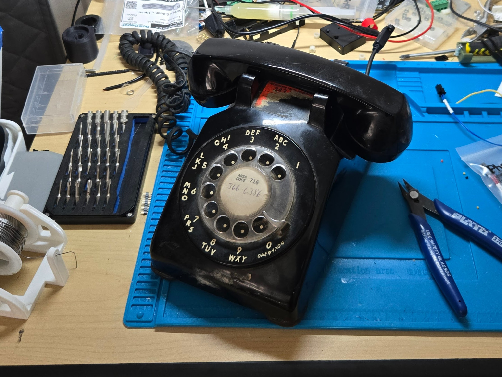

# RotaryCell

RotaryCell converts a traditional rotary telephone into a self-contained, battery-powered, portable cellular telephone **without modifying the original telephone**.

The design continues to use the original handset, rotary dial, switch-hook, mechanical ringer, network block, and existing jacks. The added electronics mount reversibly inside the case; no original telephone parts need to be drilled, cut, or permanently altered.

The working prototype can be carried and operated away from a fixed telephone connection, making the original desk telephone usable at meetings, demonstrations, or anywhere compatible cellular service is available.

**[Watch the brief RotaryCell introduction and demonstration on YouTube](https://youtu.be/PO0PJNvnMdw).**

## Build RotaryCell

The illustrated **[RotaryCell build guide](https://fregacmols.github.io/RotaryCell/)** is the recommended construction path. It walks through sourcing, PCB ordering, LilyGO preparation, board assembly, wiring, firmware, installation, and final testing using the Audio/Reset A4 and AG1171 carrier boards.

Its editable source is kept in [`guide/`](guide/); engineering records and earlier hardware documentation remain in their existing repository folders.

> [!NOTE]
> **Project status — September 2026:** The photographed PCB build is operational for incoming and outgoing calls, rotary dialing, ringing, handset audio, charging, and hardware reset. Firmware v0.10.4 is the stable public baseline; newer development sources are available under [`development/firmware`](development/firmware/). Ongoing firmware and endurance work is recorded in [STATUS.md](STATUS.md).

## Legacy hand-wired prototype reference

The first working prototype was assembled point-to-point before the dedicated PCBs were available. Its wiring and component reference is retained as an engineering record:

**[Open or download the full-resolution printable PDF](docs/RotaryCell_Complete_Prototype_Wiring.pdf).** It covers the LilyGO, protected 21700, passive audio components, AG1171, GPIO connections, and original Model 500 circuitry without using the new PCBs. This is not an equivalent alternative to the build guide: arranging, insulating, and troubleshooting all of the loose components and wiring is substantially more difficult, and the prototype documents do not describe the present PCB assembly process.

## Current baseline

This repository records the current tested baseline as of **September 18, 2026**:

- Firmware **v0.10.4** remains the stable public baseline.
- Firmware **v0.11.1-dev** is the active hardware-validation build and its source is included in the repository.
- The **Audio and Reset A4** and **AG1171 Carrier Through-Hole** PCBs have been received and assembled.
- Incoming and outgoing calls, rotary dialing, ringing, audio, manual hardware reset through service code `9999`, and AG1171 idle power saving have operated on assembled PCB builds.
- The manual hardware reset recovered a field-observed state in which incoming calls went directly to voicemail. Automatic detection and recovery of that failure is still future work.
- The optional INA226/microSD logger has recorded long-duration current data; its current measurements are useful, while its bus-voltage and calculated-power fields still require correction.
- The manufacturing packages are archived exactly as submitted and are the versions used by the illustrated build guide.

See [STATUS.md](STATUS.md) for the distinction between tested behavior and the validation work still in progress.

## System overview

- A LilyGO T-A7670G-S3 Standard board supplies the ESP32-S3 controller, A7670 cellular modem, battery charging, and cellular audio interface.
- A Silvertel AG1171 subscriber-line interface operates the telephone line circuitry, senses the switch-hook, and drives the mechanical ringer.
- The Audio and Reset A4 PCB provides adjustable transmit/receive audio conditioning and a hardware power-cycle circuit for recovery when software-only modem reset is insufficient.
- A single 21700 cell connects to the LilyGO `BAT` and `BATN` battery points through a harness in place of the original 18650 holder. The AG1171 carrier takes `VPWR` from the LilyGO `VBAT` header pad and returns through LilyGO system GND, keeping its load current within the LilyGO's onboard low-side battery-protection path.

The telephone's RJ11 line jack is used only to deliver regulated 5 V to the LilyGO charging input on the designated pins. It does not power the AG1171 directly and is not used as a telephone-line interface.

## Repository layout

| Path | Contents |
| --- | --- |
| `firmware/current` | Current Arduino sketch and source files |
| `firmware/prebuilt` | Current application OTA binary and source ZIP |
| `firmware/archive` | Historical firmware snapshots |
| `development/firmware` | Active development and hardware-validation firmware |
| `hardware/audio-reset-a4` | Exact Audio and Reset A4 source and manufacturing package |
| `hardware/ag1171-carrier-through-hole` | Exact through-hole carrier source and Gerber package |
| `hardware/prototype` | Material associated with the working hand-wired prototype |
| `hardware/experimental` | Unfinalized schematics, layouts, libraries, and alternatives |
| `hardware/legacy` | Older hardware documentation retained for reference |
| `guide` | Primary illustrated construction guide and its web source |
| `docs` | Architecture, bring-up, and historical documentation |
| `site` | Draft project-page copy for evilroot.net |

To build RotaryCell, start with the [illustrated build guide](https://fregacmols.github.io/RotaryCell/) and use [STATUS.md](STATUS.md) for current validation notes. The older [prototype wiring reference](docs/RotaryCell_Complete_Prototype_Wiring.pdf), [hardware wiring](docs/HARDWARE_WIRING.md), [master BOM](docs/MASTER_BOM.md), and [assembly guide](docs/ASSEMBLY_GUIDE.md) remain available as engineering references. Instructions for compiling the software are kept separately in [FIRMWARE_BUILDING.md](FIRMWARE_BUILDING.md).

## Current functions

- Rotary pulse dialing and switch-hook detection
- Incoming and outgoing cellular calls
- Physical bell ringing through the AG1171
- North American dial, reorder, and receiver-off-hook warning tones
- Bidirectional handset audio with adjustable levels
- Battery monitoring
- USB diagnostics and a temporary maintenance Wi-Fi dashboard
- Browser/USB AT-command terminal and persistent event log
- Cellular-network clock synchronization and application OTA updates

Dial service code `0000` starts maintenance Wi-Fi. The USB console command `WIFI ON` provides access when the dial cannot be used. Service code `9999` records pre-reset diagnostics and triggers the A4 hardware power-cycle circuit; v0.11.1-dev successfully used that path to clear the field-observed modem failure described in [STATUS.md](STATUS.md).

## Important cautions

- Never connect prototype Tip/Ring wiring or the repurposed charging jack to the public telephone network or energized premises telephone wiring.
- Clearly label the charging jack and verify its regulated voltage, polarity, pin assignment, and protection before use.
- Lithium-ion cells require suitable protection, charging, fusing, insulation, and mechanical restraint.
- The maintenance access point uses the development password `rotarycell`. Change `WIFI_AP_PASSWORD` in `Config.h` before use around untrusted people.
- The August 2026 PCB files are preserved **as ordered**. Record later board changes as a new revision rather than silently replacing that package.

## Repository policy

This public repository preserves the tested firmware, board files, illustrated
construction guide, and the engineering history behind RotaryCell. Files under
`hardware/audio-reset-a4` and `hardware/ag1171-carrier-through-hole` record the
exact boards used in the photographed builds. Continuing firmware and
reliability work is tracked in [STATUS.md](STATUS.md).

## License

Code and original documentation in this repository are licensed under the [MIT License](LICENSE). Third-party datasheets, vendor names, trademarks, and historical telephone designs remain the property of their respective owners.
