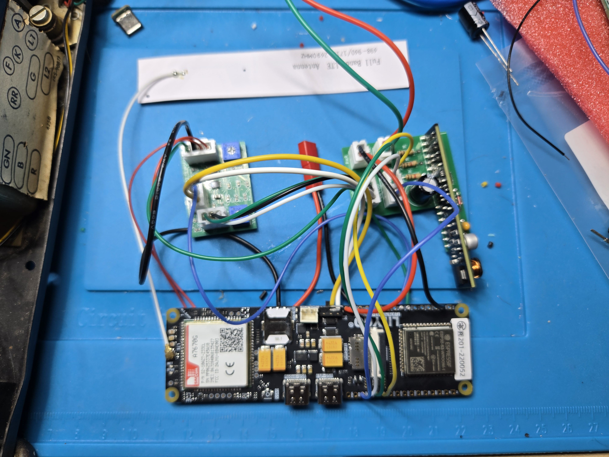

# Project status

**Baseline date:** September 18, 2026

**Stable firmware:** v0.10.4
**Active development firmware:** v0.11.1-dev
**Hardware phase:** Multiple integrated PCB assemblies operational; extended features under endurance testing

## Tested on the hand-wired prototype

- Original rotary dial pulse decoding
- Switch-hook detection
- Dial tone generation
- Incoming-call detection and physical bell ringing
- Answer and hang-up behavior
- Outgoing cellular calls
- Bidirectional handset audio through the passive interface
- Battery voltage and approximate state-of-charge reporting
- Maintenance Wi-Fi, browser dashboard, live console, and AT terminal
- Persistent event logging and cellular-network clock synchronization
- North American reorder and receiver-off-hook warning tones

The prototype has operated successfully in normal use and during public demonstration.

## Modem failure and recovery

After approximately one hour of operation during an August 25 field test, the modem remained registered but stopped originating and receiving calls. Incoming calls went to voicemail, outgoing calls returned `+CME ERROR: no network service`, and service code `9999` did not recover the modem. Cycling the LilyGO board's physical power switch restored incoming calls.

This is the reason the A4 audio board includes a hardware power-cycle circuit. Firmware v0.11.1-dev drives that circuit through GPIO35 when service code `9999` is dialed. The reset path was tested on battery power and cleared a repeated failure in which incoming calls went directly to voicemail. The firmware records paired pre-reset and post-reset diagnostic snapshots in persistent flash.

No reliable automatic signature for the failure has yet been identified, so recovery still requires the `9999` service code. Automatic detection and recovery remain important reliability work.

## First integrated PCB assembly

| Assembly | Ordered package | Current status |
| --- | --- | --- |
| Passive audio and reset PCB | `hardware/audio-reset-a4/` | Received and assembled in multiple builds; audio functions and the service-code `9999` hardware power-cycle trigger have passed testing on battery power |
| AG1171 through-hole carrier | `hardware/ag1171-carrier-through-hole/` | Received and assembled; telephone functions and runtime-toggleable AG1171 idle power saving have passed initial testing |

*First assembled Audio/Reset A4 and AG1171 carrier boards connected to the LilyGO during initial functional bench testing. This shows the development setup and loose test wiring, not the final installation or an authoritative wiring reference.*

The Audio and Reset A4 board is approximately 35.00 x 25.15 mm. The notched AG1171 carrier has an overall Gerber envelope of approximately 54.91 x 42.67 mm.

## v0.11.1-dev validation completed so far

- Incoming and outgoing calling, rotary dialing, physical ringing, and bidirectional audio operate on the PCB assembly.
- Service code `9999` triggers the A4 battery-path reset and recovers the observed stuck-modem state when the phone is running from its battery.
- Paired reset diagnostics survive the power cycle and are stored in the ESP32 persistent event log.
- Maintenance Wi-Fi can be started from the dial or USB console, held open for an extended session, and reopened automatically after a successful web firmware update.
- The maintenance page can download the persistent event log and microSD power-log files.
- AG1171 idle power saving reduced a measured 11.17-hour Wi-Fi-off test to a 104.44 mA average, implying roughly 44–50 practical standby hours from the tested 5800 mAh cell.
- The optional INA226/microSD logger records usable current data. Its bus-voltage and calculated-power columns currently remain zero and are not yet authoritative.

Large microSD downloads deliberately pause sampling while the synchronous transfer is in progress. A test download of an approximately 19 MB log produced a 44.9-second gap; this is acceptable for maintenance use and is recorded for future asynchronous work.

## Next validation milestone

1. Record clear photographs, fitted component values, polarities, connector orientations, and any assembly rework from the first build.
2. Record repeatable measurements and individual pass/fail results for audio, dialing, hook detection, calling, ringing, and charging.
3. Identify a dependable modem-failure signature and add conservative automatic recovery.
4. Correct or explicitly remove the invalid INA226 bus-voltage and calculated-power fields.
5. Repeat incoming, outgoing, ringing, charging, battery, and endurance tests on complete assemblies.
6. Promote a reviewed development build to a new stable release only after those results are documented.

Until these steps pass, the ordered PCBs should be considered **working development hardware**, not a production-qualified design.
