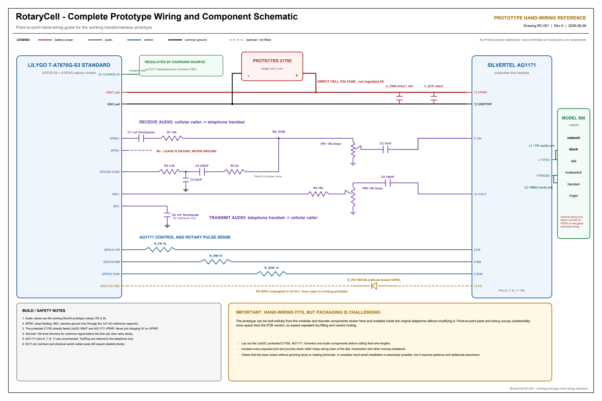
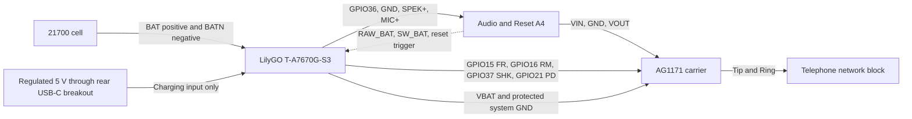

# Hardware wiring and connector pinouts

> The [illustrated build guide](../guide/README.md) is the current construction
> authority. This page supplies additional electrical detail and retains the
> hand-wired prototype reference below.

## Primary hand-wired prototype reference

To reproduce the proven prototype from modules and discrete components, begin with the **[complete prototype wiring and component schematic](RotaryCell_Complete_Prototype_Wiring.pdf)**:

This master drawing follows the working RevA2 passive-audio implementation and deliberately omits the proposed automatic-reset circuit. It shows direct module-pin and component wiring rather than PCB connectors. The complete assembly can fit inside the original telephone without modifying it, but loose components and point-to-point wiring make placement, insulation, strain relief, and repeated dry-fitting important.

The remainder of this page documents the newer Audio and Reset A4 and AG1171 carrier PCB interconnects.

**Baseline:** Audio and Reset A4 plus AG1171 Carrier Through-Hole, as ordered August 2026

This document translates the ordered EasyEDA schematics into cable-level connections. The native EasyEDA sources remain authoritative. Pin numbers below are electrical pin numbers; do not infer pin 1 from a left-to-right view of a loose mating housing. Confirm the pin-1 mark on the PCB and header before crimping a harness.

## System interconnect

## Audio and Reset A4

### J1 - LILYGO, 4-pin JST-XH

| J1 pin | Board signal | Connect to |
| ---: | --- | --- |
| 1 | Tone/PWM input | LilyGO ESP32-S3 GPIO36 |
| 2 | Common GND | LilyGO GND |
| 3 | Receive audio input | LilyGO `SPEK+` |
| 4 | Transmit audio output | LilyGO `MIC+` |

The ordered board uses one signal conductor in each audio direction. The working prototype follows the RevA2 audio reference for the two LilyGO negative audio terminals:

- Leave `SPEK-` unconnected and floating. Never connect `SPEK-` to ground; the LilyGO speaker output is bridge-tied.
- Connect `MIC-` to common ground only through a 1 uF nonpolar capacitor. The documented build uses a Murata RDER71H105K2M1H03A radial ceramic at the LilyGO/harness rather than on the A4 audio PCB.

The 1 uF `MIC-` reference capacitor was called C6 in the RevA2 drawing. It is not the A4 board's C6; A4 C6 is the 4.7 uF reset-timing capacitor.

### J2 - AG1171_AUDIO, 3-pin JST-XH

| J2 pin | Board signal | Carrier connection |
| ---: | --- | --- |
| 1 | AG1171 `VIN` | Carrier U2 pin 1 |
| 2 | Common GND | Carrier U2 pin 2 |
| 3 | AG1171 `VOUT` | Carrier U2 pin 3 |

This cable is straight-through: 1-to-1, 2-to-2, and 3-to-3.

### U2 - hardware power-cycle, 3-pin JST-XH

| U2 pin | Schematic net | Intended connection |
| ---: | --- | --- |
| 1 | `SW_BAT` | Switched side of the LilyGO physical power-switch path |
| 2 | `RAW_BAT` | Raw cell-positive side of that switch path |
| 3 | Trigger | LilyGO GPIO35 |

The reset circuit shares ground through J1 pin 2. The required guide firmware
uses GPIO35 for U2 pin 3. `SW_BAT` attaches to the center power-switch terminal;
`RAW_BAT` attaches to the battery-side switch pad shown in the guide. Confirm
the two nodes with a continuity meter before soldering because board revisions
may differ.

### Audio paths

- Receive: `SPEK+` -> C1 1 uF -> R1 10 kOhm -> SPK_LVL 10 kOhm -> C2 10 nF -> AG1171 `VIN`.
- Tone injection: GPIO36 -> R2 3.3 kOhm with C3 22 nF to ground -> C4 220 nF -> R3 1 kOhm -> receive summing node.
- Transmit: AG1171 `VOUT` -> C5 100 nF -> MIC_LVL 10 kOhm -> R4 10 kOhm -> `MIC+`.
- LilyGO audio references: `SPEK-` remains floating; `MIC-` connects to common ground through an external 1 uF nonpolar capacitor.

The image above covers the audio portion only. The reset circuit is present in the native A4 EasyEDA source.

## AG1171 Carrier Through-Hole

### CN1 - AG1171 power, 2-pin JST-XH

| CN1 pin | Signal | Connection |
| ---: | --- | --- |
| 1 | `GND PWR` | LilyGO system GND |
| 2 | `VPWR` | LilyGO header pad marked `VBAT` |

The LilyGO `VBAT` pad is on the cell-positive rail, but its exposed system GND is separated from the holder-negative `BATN` node by the onboard low-side battery protector. Connect carrier CN1 pin 1 to LilyGO system GND—not directly to holder negative or `BATN`—so the AG1171 load cannot bypass that protection. Do **not** apply the regulated 5 V charging input to CN1. Confirm voltage and polarity at the empty AG1171 socket before installing the module.

### U2 - audio, 3-pin JST-XH

| U2 pin | AG1171 signal | Audio-board connection |
| ---: | --- | --- |
| 1 | `VIN`, AG1171 pin 9 | Audio J2 pin 1 |
| 2 | Common GND | Audio J2 pin 2 |
| 3 | `VOUT`, AG1171 pin 10 | Audio J2 pin 3 |

### U3 - logic, 4-pin JST-XH

| U3 pin | Carrier function | LilyGO connection |
| ---: | --- | --- |
| 1 | `FR`, through R3 1 kOhm | GPIO15 |
| 2 | `RM`, through R2 1 kOhm | GPIO16 |
| 3 | `SHK`, through R1 1 kOhm | GPIO37 |
| 4 | `PD`, through D2 1N4148 | GPIO21; high-impedance normally and LOW for power-down; never drive HIGH |

The required guide firmware implements GPIO21 as a low-or-high-impedance
control. The AG1171 datasheet prohibits driving `PD` HIGH.

### CN2 - telephone line, 2-pin JST-XH

| CN2 pin | AG1171 signal | Intended connection |
| ---: | --- | --- |
| 1 | `Ring(B)`, AG1171 pin 1 | Telephone's internal line/network-block connection |
| 2 | `Tip(A)`, AG1171 pin 2 | Telephone's internal line/network-block connection |

Network-block screw terminals differ among telephone models and revisions.
Trace the telephone's original incoming-line connection or consult its schematic
rather than copying the photographed terminal positions or wire colors. This
internal Tip/Ring pair must never be connected to the PSTN or energized premises
wiring.

## AG1171 pins used by the carrier

| AG1171 pin | Name | Routed to |
| ---: | --- | --- |
| 1 | Ring(B) | CN2 pin 1 |
| 2 | Tip(A) | CN2 pin 2 |
| 3 | FR | U3 pin 1 through 1 kOhm |
| 4 | RM | U3 pin 2 through 1 kOhm |
| 5 | SHK | U3 pin 3 through 1 kOhm |
| 6, 7, 8 | NC | No connection |
| 9 | VIN | U2 pin 1 |
| 10 | VOUT | U2 pin 3 |
| 11 | NC | No connection |
| 12 | GND PWR | CN1 pin 1 and U2 pin 2 |
| 13 | VPWR | CN1 pin 2 |
| 14 | PD | U3 pin 4 through D2 |

The illustrated guide provides the installed-board photographs, printed carrier
files, rear USB-C connector options and tested routing that are intentionally
outside this electrical reference.
