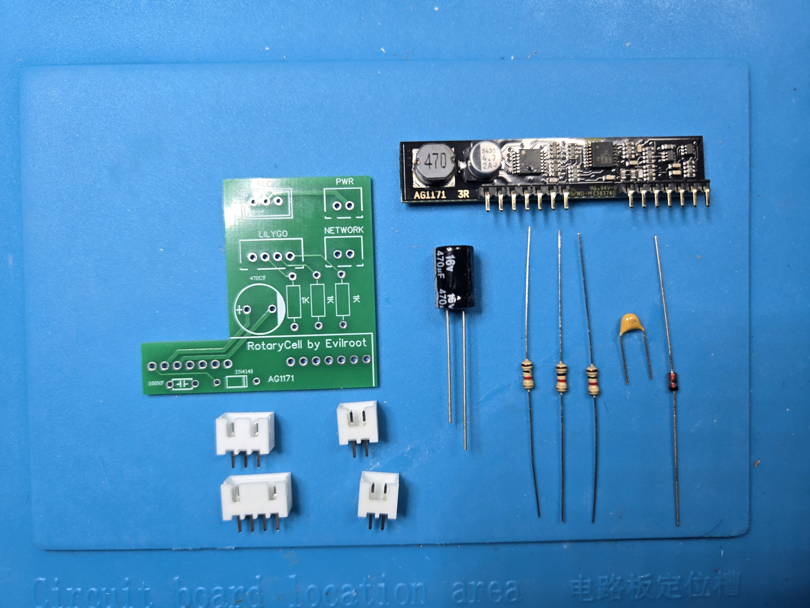
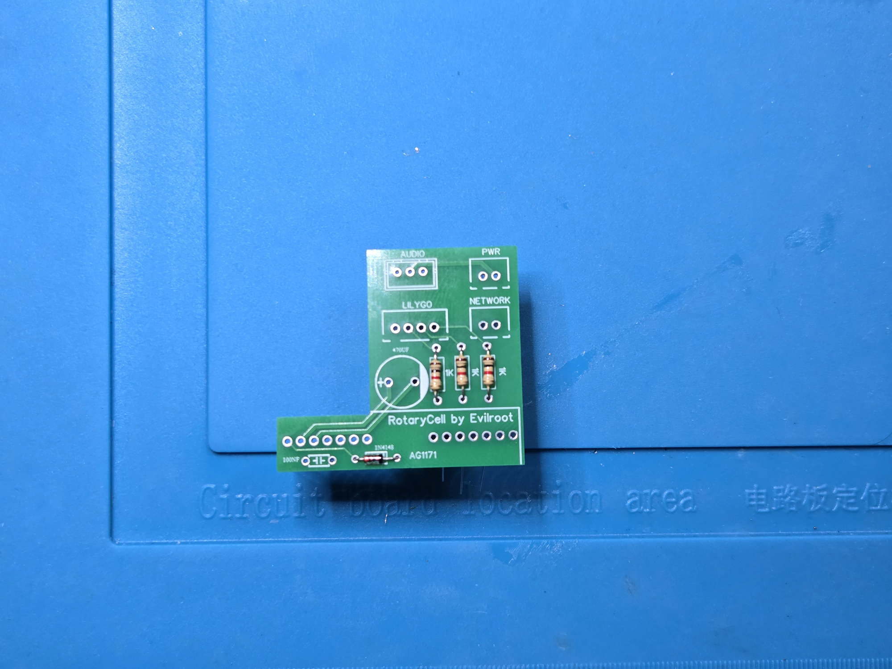
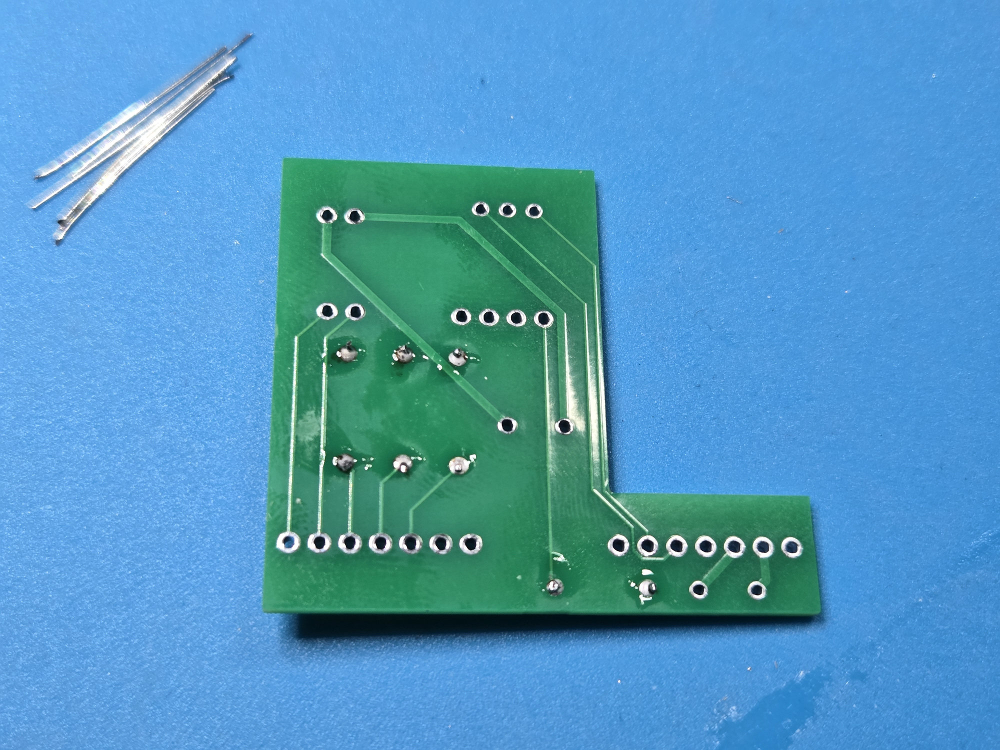
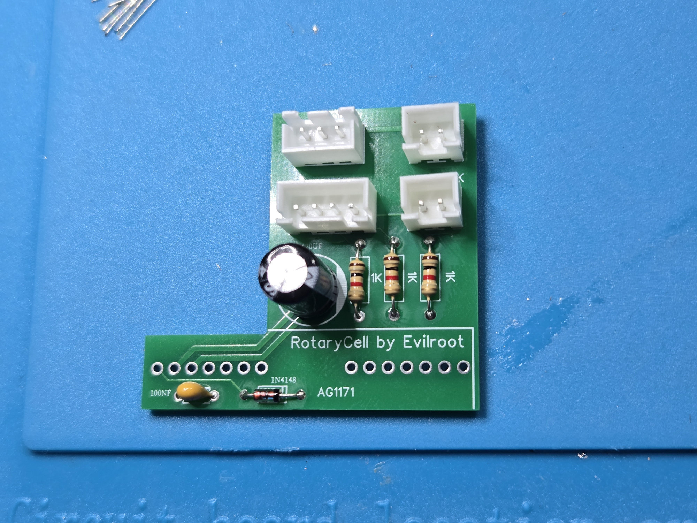
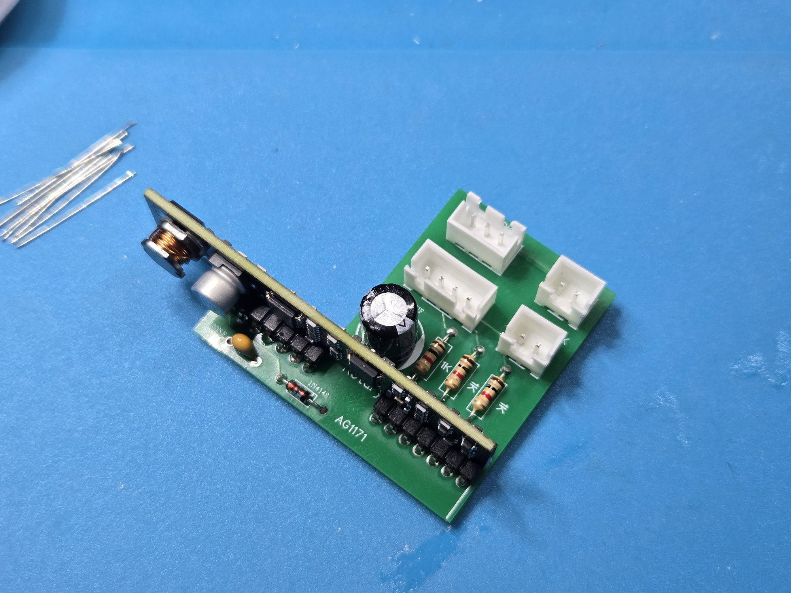
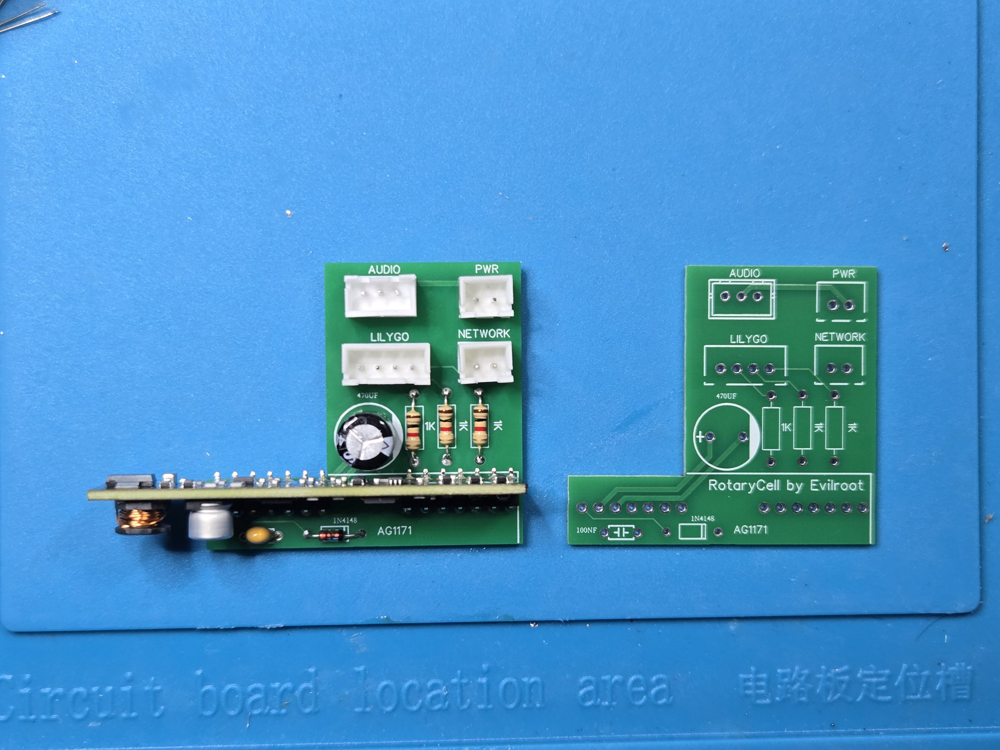

RotaryCell / build guide

# Assemble the AG1171 carrier

The carrier is a straightforward through-hole board. We are soldering
through-hole components by hand here, like Neanderthals. Install the
low-profile parts first, followed by the capacitor and connectors, and add the
AG1171 module last.

For one carrier you need three 1 kΩ resistors, one 100 nF capacitor, one
1N4148 diode, one 470 µF 16 V electrolytic capacitor, four keyed headers and
the AG1171 module.

## 1. Install the small parts

Fit the three resistors, the 100 nF capacitor and the diode. The resistors and
small capacitor can face either direction. Match the band on the 1N4148 to the
bar printed on its PCB outline.

Solder the leads from the back and trim them close to the joints.

## 2. Add the capacitor and connectors

Install the 470 µF capacitor with its positive lead in the hole marked `+`.
Fit the four keyed headers in the orientations shown below: `LILYGO`, `AUDIO`,
`NETWORK` and `PWR`.

## 3. Install the AG1171

Insert the AG1171 module through the long row of holes and solder every pin.
The module stands perpendicular to the carrier board.

The completed carrier should match the board at the top of this comparison.

Before moving on, look over the solder side for missed pins or bridges and
confirm that the diode and electrolytic capacitor match their printed polarity
marks.
