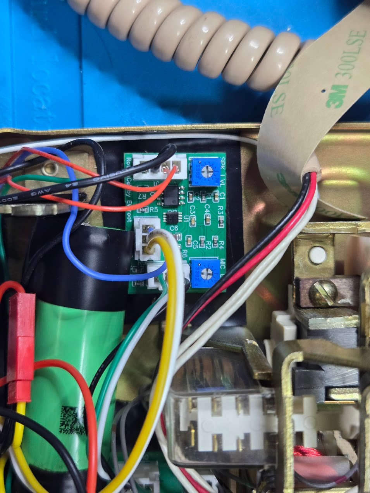

RotaryCell / build guide

# Test calls and adjust audio

Keep the case open so both level trimmers remain accessible. Before placing a
call, set both trimmers to approximately the middle of their travel. Halfway is
a good starting point; the final settings depend on the telephone, handset and
how loudly its carbon microphone speaks.

<figure markdown>
  
  <figcaption>The upper <strong>SPK_LVL</strong> trimmer controls the earpiece volume. The lower <strong>MIC_LVL</strong> trimmer controls the level heard by the person at the other end of the call.</figcaption>
</figure>

Use a small screwdriver and move each trimmer only a little at a time. Do not
force it past either end of its adjustment range.

1. Lift the handset and confirm that the dial tone is comfortably audible.
2. Place an outgoing call. Confirm that you hear ringback and that both people
   can hear one another after the call is answered.
3. Adjust **SPK_LVL** for a clear, comfortable earpiece level without harshness
   or distortion.
4. Speak at a normal distance and volume while the other person listens.
   Adjust **MIC_LVL** until your voice is clear without clipping or excessive
   background noise.
5. Place an incoming call and confirm that the telephone rings, answers, and
   again carries audio in both directions.

The microphone trimmer can also change how much sidetone you hear in your own
earpiece, so judge microphone level primarily from the other telephone. Repeat
the outgoing and incoming tests after the case is fitted; the closed housing
can make the perceived level slightly different.

If the dial tone is extremely faint, the trimmers affect it but never produce
normal volume, and cellular-call audio is missing, check the LilyGO-to-audio
board harness pin by pin. A reversed connector caused exactly those symptoms
in one of the working builds. The plug still seated normally, which made the
fault easy to mistake for a bad LilyGO or audio board.
