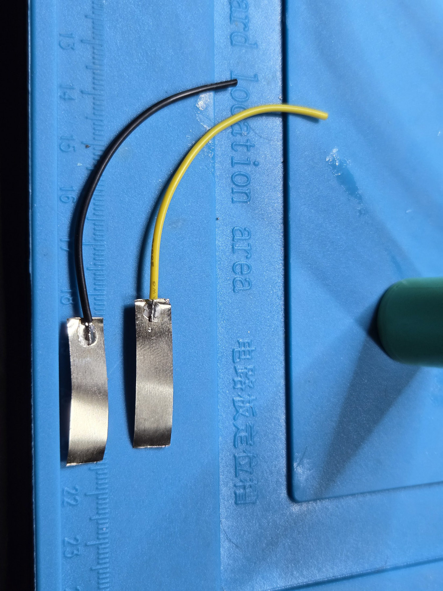
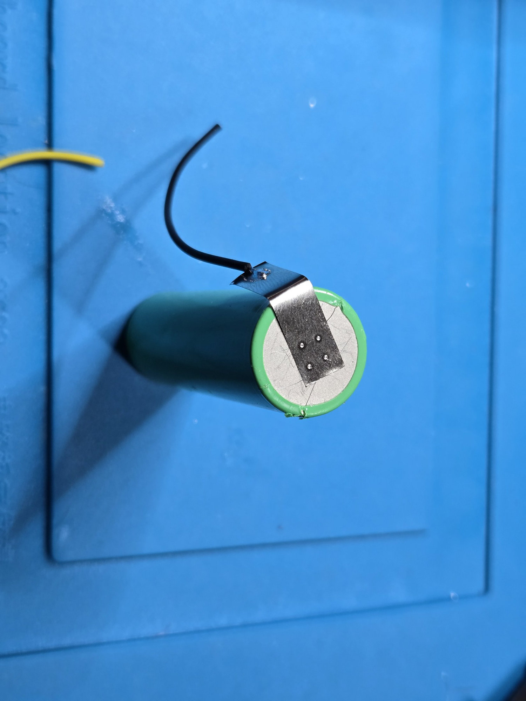
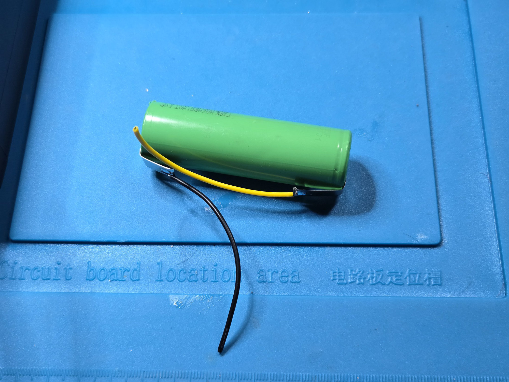
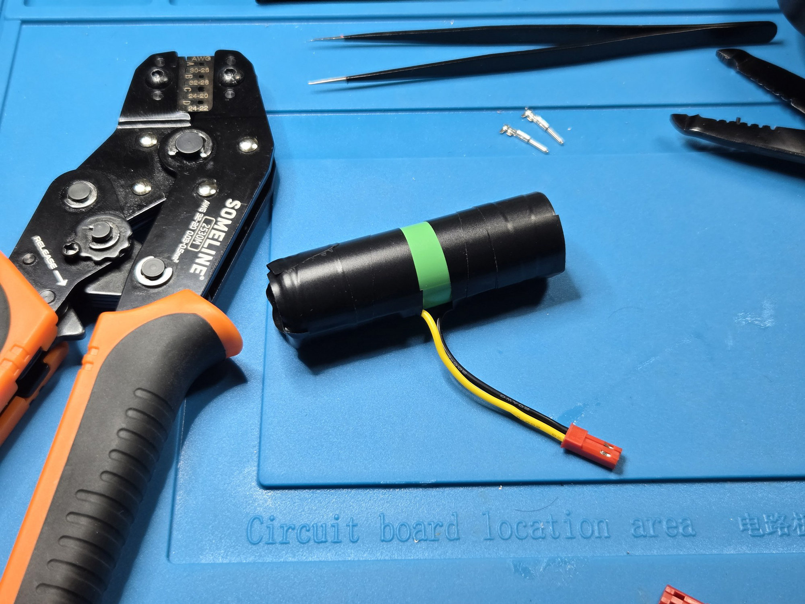

RotaryCell / build guide

# Prepare the battery

This build uses one [Samsung 58E 21700 cell](https://www.18650batterystore.com/products/samsung-58e-21700-battery). It is a flat-top, unprotected 5330 mAh cell. The LilyGO provides the charging and battery protection used here.

The finished battery harness uses 10 cm lengths of 24 AWG wire: yellow for battery positive and black for battery negative. I soldered each wire to a nickel tab before attaching the tabs to the cell.

## Solder or spot-weld?

It is possible to solder nickel tabs directly to a cylindrical cell. [This
video demonstrates the technique](https://www.youtube.com/watch?v=CkbKCwelx0g),
which depends on a powerful iron, good surface preparation and very short
contact time so the joint forms before much heat reaches the cell.

Small battery spot welders have become inexpensive and easy to use, and I
recommend one for this build. A spot welder concentrates the energy at the
weld points instead of heating the end of the cell with a soldering iron,
making it the safer choice for attaching these tabs. It also makes it easier
to produce a secure connection without prolonged heating. Practice on spare
nickel strip before working on the battery, and check that each tab is firmly
attached before insulating it.

## Attach and insulate the tabs

Spot-weld the black lead to the negative end and the yellow lead to the positive end. The photographs show the sequence I used, but this guide does not attempt to teach battery spot welding.

Fold the tabs along the side of the cell so the leads leave in the same direction. Insulate both ends of the cell and every exposed part of the tabs.

Fit the red two-pin connector in the same orientation used by the LilyGO battery harness. The completed battery should look like this:

Check the connector polarity once before plugging it into the LilyGO. The black
lead goes to LilyGO `BATN`; it is not the same connection as the system ground
used by the carrier board.

!!! note "Why BATN must remain separate"
    `BATN` is the raw battery-negative connection on the battery side of the
    LilyGO's protection circuit. The ordinary `GND` points are on the protected
    system side. Joining `BATN` to another ground would bypass that separation
    and prevent the protection circuit from disconnecting the battery-negative
    path when required. Connect only the cell's negative lead to `BATN`; every
    other ground connection belongs on `GND`.
