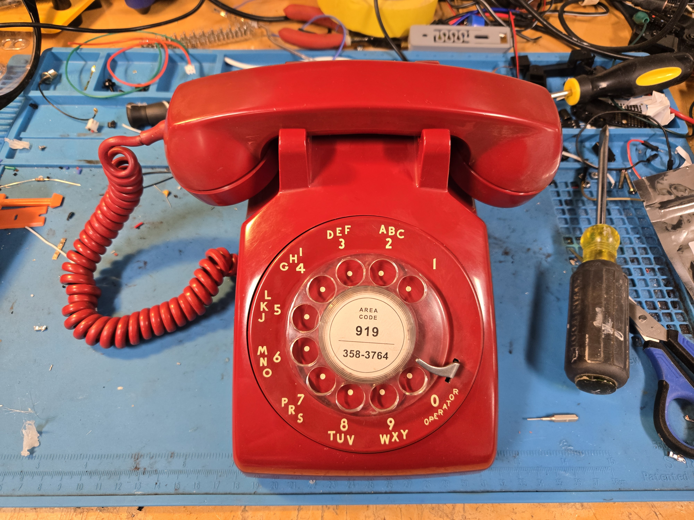

RotaryCell / build guide

# Test your RotaryCell

Repeat a brief check after the case is fitted. Closing the telephone can shift a
wire, affect the perceived audio level or reveal interference that was not
obvious while the dial was raised.

<figure markdown>
  
  <figcaption>Another completed RotaryCell conversion, assembled and ready for its final call checks.</figcaption>
</figure>

## Final checklist

- [ ] Incoming call and bell ringing
- [ ] Outgoing call and rotary dialing
- [ ] Hook operation and two-way audio
- [ ] Charging and battery operation
