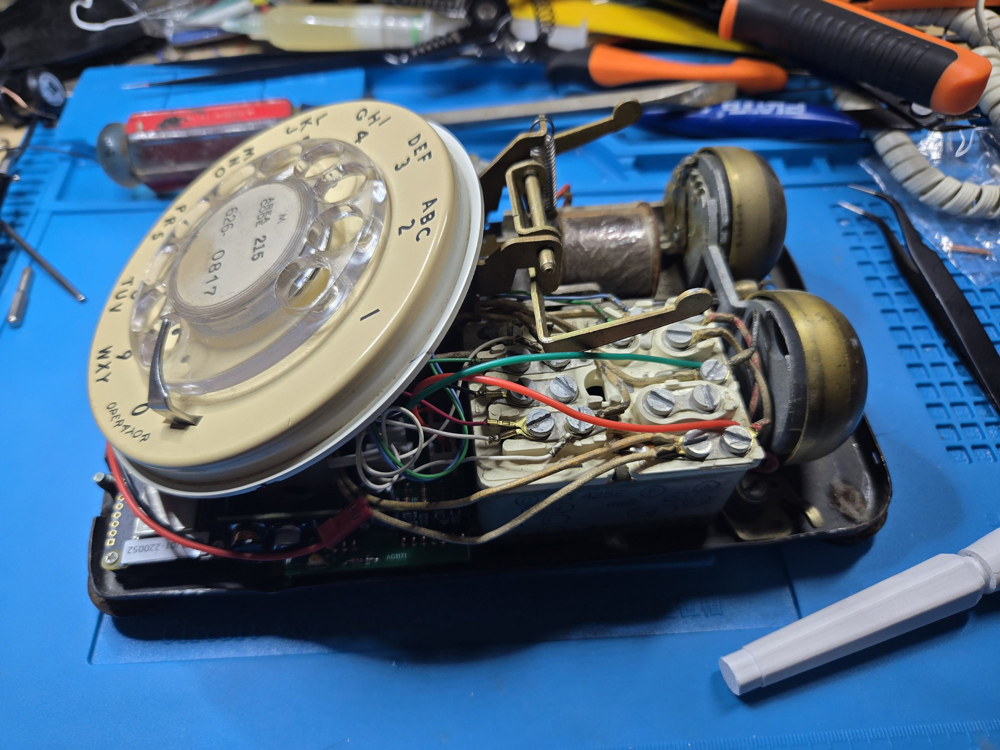
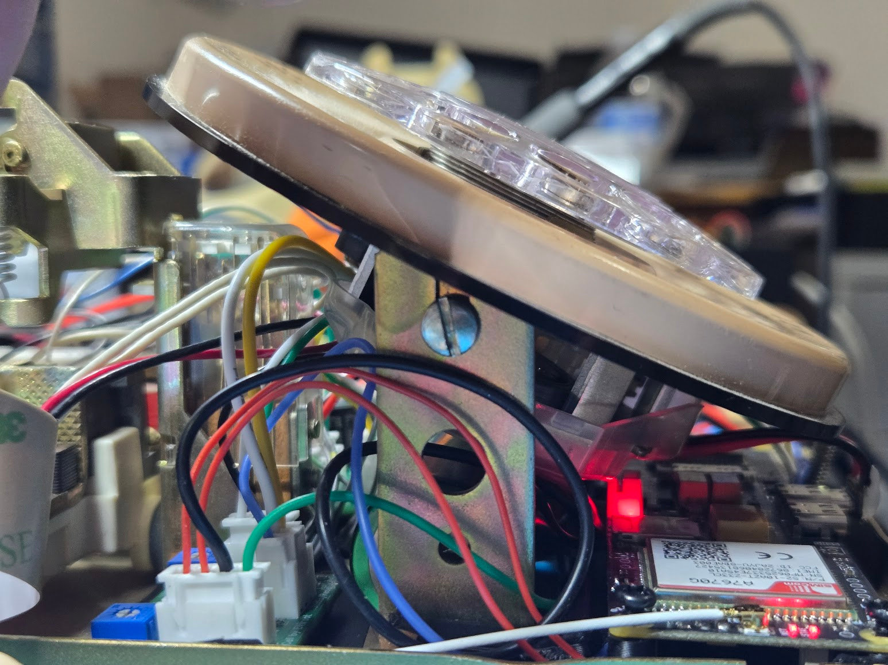
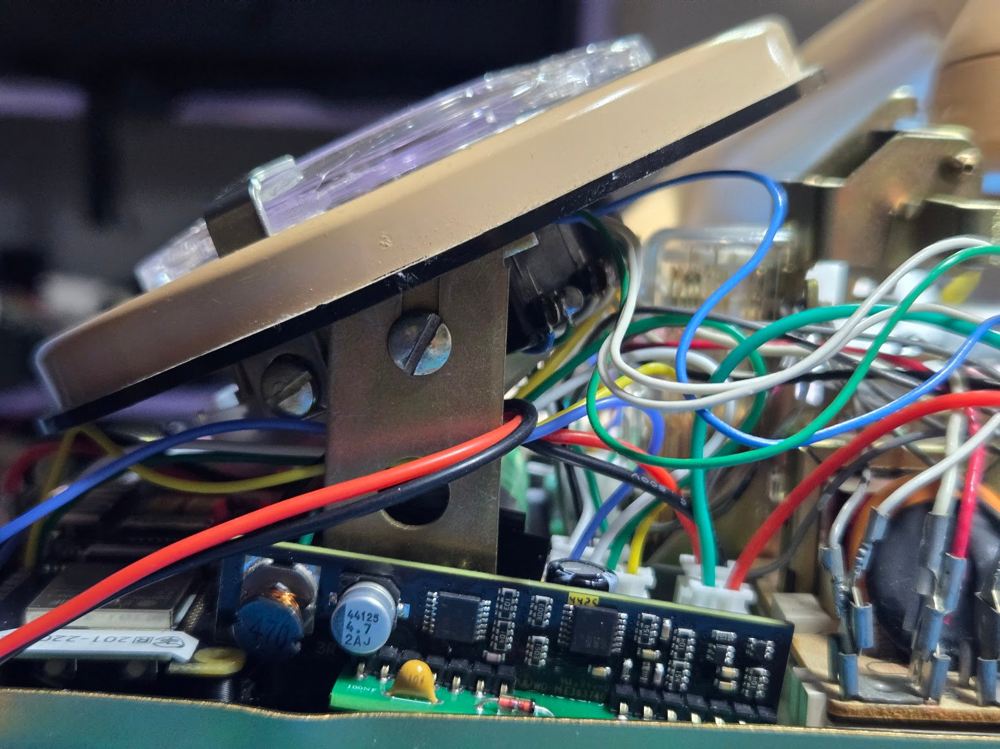
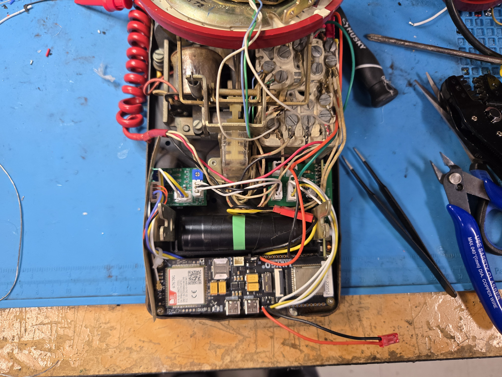
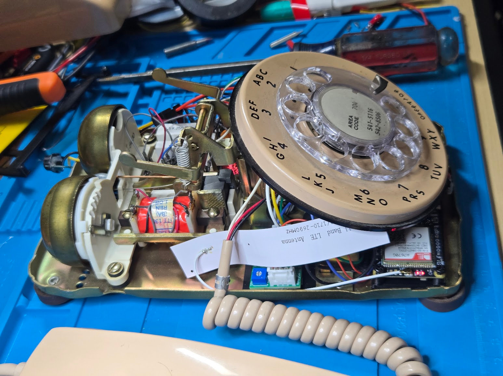

RotaryCell / build guide

# Close the case

After the open-case tests and audio adjustment, lower the dial assembly back over its two mounting posts. Guide the new wiring into the open spaces around the network block rather than under the dial or hookswitch mechanism, then tighten the two flathead screws loosened during disassembly.

<figure markdown>
  
  
  <figcaption>These close-ups were taken after the new boards were installed. Seat the dial bracket over both metal posts, then tighten the slotted flathead screw on each post.</figcaption>
</figure>

Operate the hookswitch and turn the dial once while the case is still open. If both move freely, refit the shell and tighten the two housing screws.

<figure markdown>
  
  <figcaption>A completed installation with the corrected audio harness before the case is closed. This telephone uses a different network-block style from some of the other examples, and its wire colors reflect the parts available during this build. Use the photograph to judge routing and clearance, not as a terminal-by-terminal wiring reference.</figcaption>
</figure>

Compare the open phone with this general layout: wiring stays below the top edge
of the base, clear of the bell clappers, dial mechanism, hookswitch and housing
screw locations. Network blocks and original telephone wiring vary, so follow
the labeled harness connections and the photographs you took during disassembly.

<figure markdown>
  
  <figcaption>The flexible LTE antenna tucked into the open space beneath the dial before closing the telephone.</figcaption>
</figure>

Lay the LTE antenna flat in the available space and route its thin coaxial lead
with a relaxed bend. Do not crease the antenna, pull on its tiny connector, or
trap either piece beneath the dial frame. Lower the dial slowly and watch from
the side to confirm that the mechanism and antenna do not touch.
