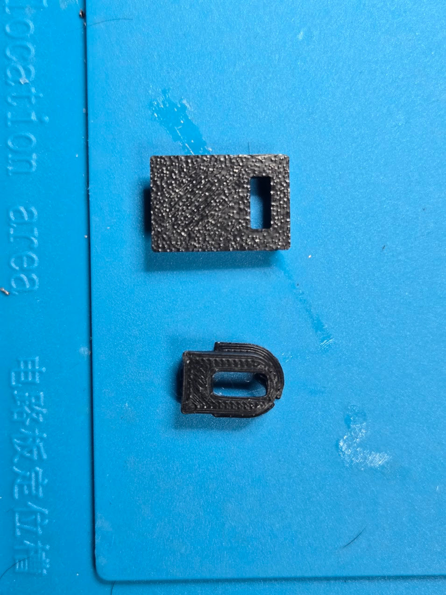
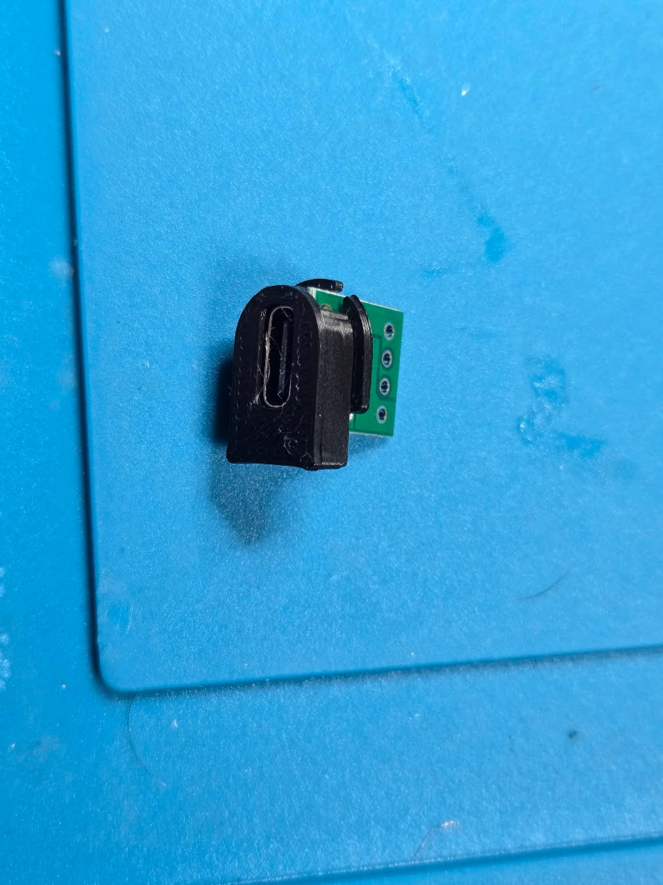
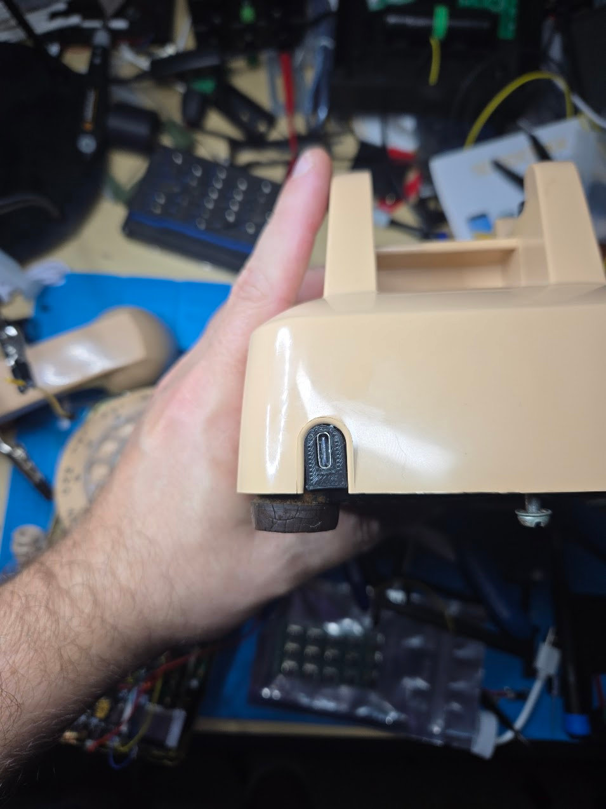
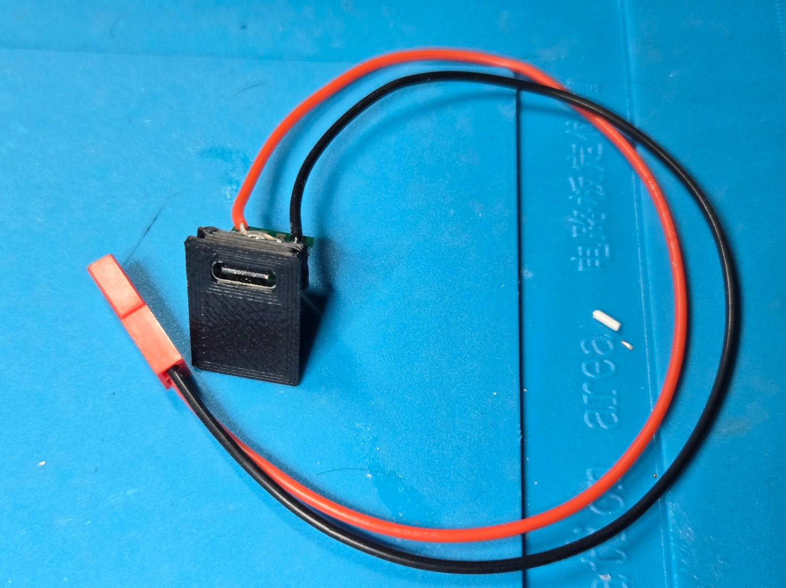
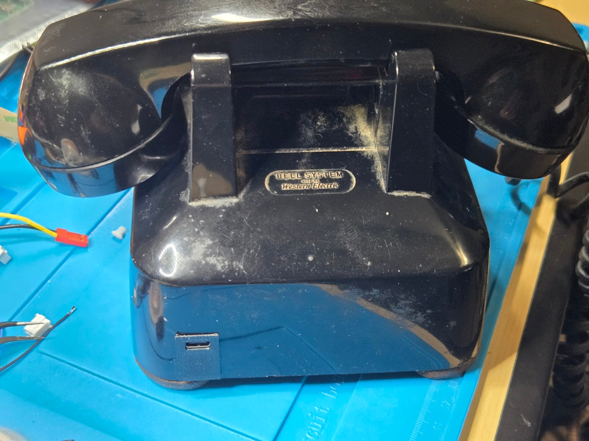
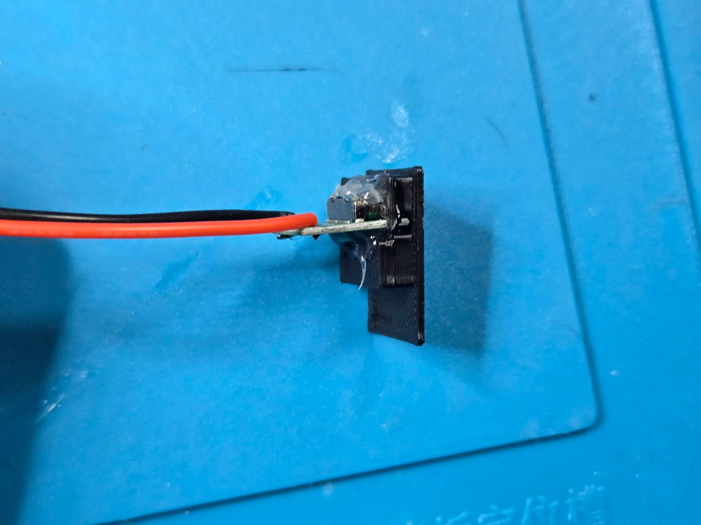

RotaryCell / build guide

# Fit the rear charging connector

Western Electric 500-series phones commonly have one of two rear openings.
The rear connector is still an area I am refining, but these are the two
current designs I prefer for the corresponding phone types. They are already a
considerable improvement over hot glue and dreams.

| Original connection | Printed insert |
| --- | --- |
| Permanently attached or captive line cord through an arched opening | [Arch_USB_TestFit_R1.stl](downloads/rear-connectors/Arch_USB_TestFit_R1.stl) |
| Removable line cord using the rectangular modular-jack opening | [Rect_USB_TestFit_R3.stl](downloads/rear-connectors/Rect_USB_TestFit_R3.stl) |

Both parts were printed in **PLA at 100% scale with 0.2 mm layers and three
walls**. Start with the outside face on the build plate as supplied. **Both
models need supports**, but the best support placement and settings depend
heavily on the printer and slicer.

These are small, detail-sensitive parts with a narrow socket opening and thin
retention features. They require a well-tuned printer to come out cleanly. A
resin printer may be especially well suited to them. Whichever process you use,
remove the supports carefully, clean up any support scars or first-layer bulge,
and test-fit the empty insert before installing the breakout board.

<figure markdown>
  
  <figcaption>The current printed pair: Rect R3 above and Arch R1 below.</figcaption>
</figure>

## Captive-cord phone: Arch R1

The arched insert follows the original cord opening and uses a small inside
shoulder to keep it from being pushed outward. The original metal tab clears
the lower portion of the insert.

<figure markdown>
  
  <figcaption>Arch R1 assembled around the USB-C breakout before installation.</figcaption>
</figure>

<figure markdown>
  
  <figcaption>Arch_USB_TestFit_R1 fitted in the original captive-cord opening.</figcaption>
</figure>

## Modular-jack phone: Rect R3

The rectangular insert slides into the original modular-jack slot. Its exterior
lip covers the open lower portion of the cutout, while the extended body engages
the metal retaining tab inside the telephone. R3 is the current revision, but I
am still refining its retention and fit.

<figure markdown>
  
  <figcaption>Rect R3 assembled with the charging leads attached.</figcaption>
</figure>

<figure markdown>
  
  <figcaption>Rect_USB_TestFit_R3 fitted in the black telephone's original modular-jack opening.</figcaption>
</figure>

I used these
[20-piece USB-C female breakout boards](https://www.amazon.com/dp/B0CB395L99).
They press into the printed channel from behind with some effort. Push the board
in evenly, with its socket facing the outside of the phone, and avoid loading
the USB-C receptacle itself.

Solder only the breakout's **V+ (VBUS)** and **GND** pads to the charging
harness prepared earlier. The USB data pads remain unconnected. These boards do
not include the USB-C configuration resistors needed to request power from a
USB-C source, so power the phone with a **USB-A-to-USB-C cable**. A USB-C-to-USB-C
cable may provide no power at all.

The press fit locates the connector. I secured the back of the breakout with
hot glue for retention and strain relief—plus dreams, as previously mentioned.
Keep the glue clear of the USB-C socket and the surfaces that fit against the
phone. After installation, verify that the plug seats fully and cannot push the
insert into the telephone.

<figure markdown>
  
  <figcaption>Adhesive at the rear retains the breakout and supports the power leads; the printed insert provides the fit to the telephone shell.</figcaption>
</figure>

Old telephone shells and printed dimensions vary slightly. Remove print-edge
bulge before enlarging an opening; if adjustment is necessary, a light pass
with a file is usually enough.
