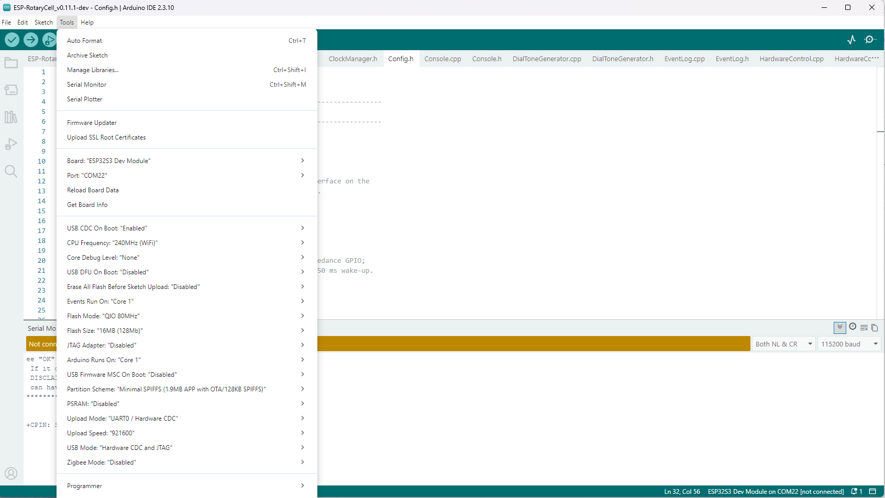
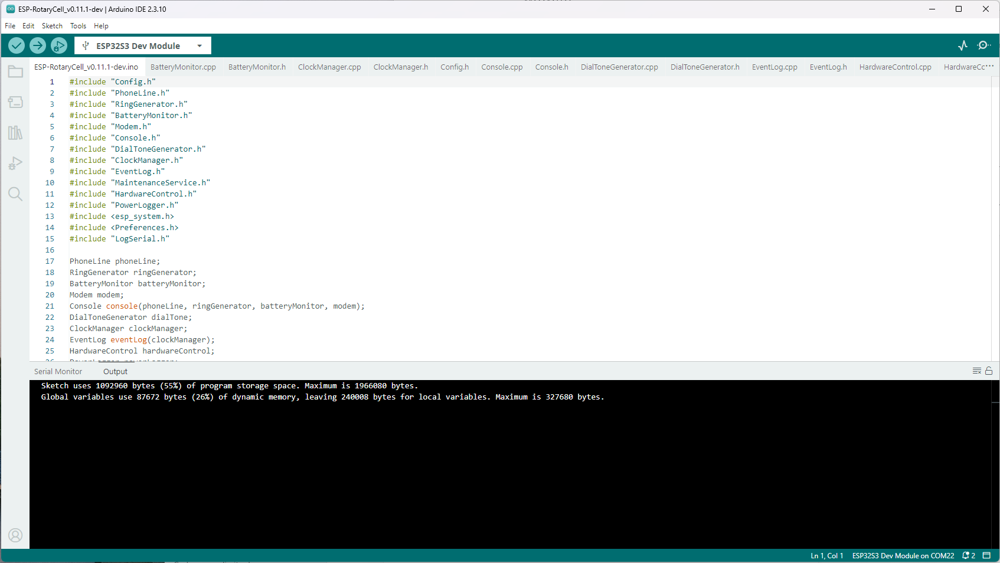
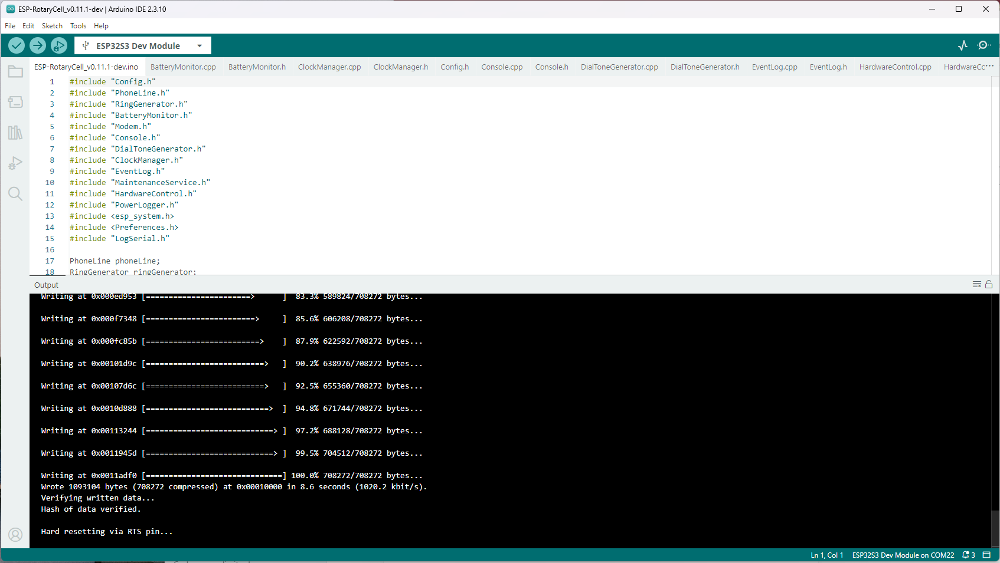
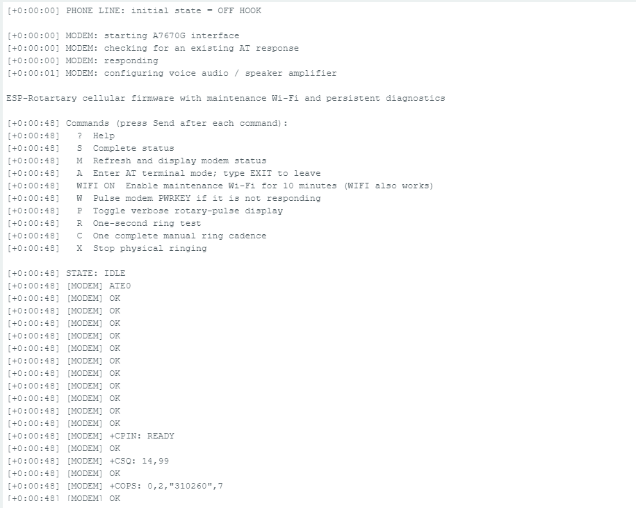
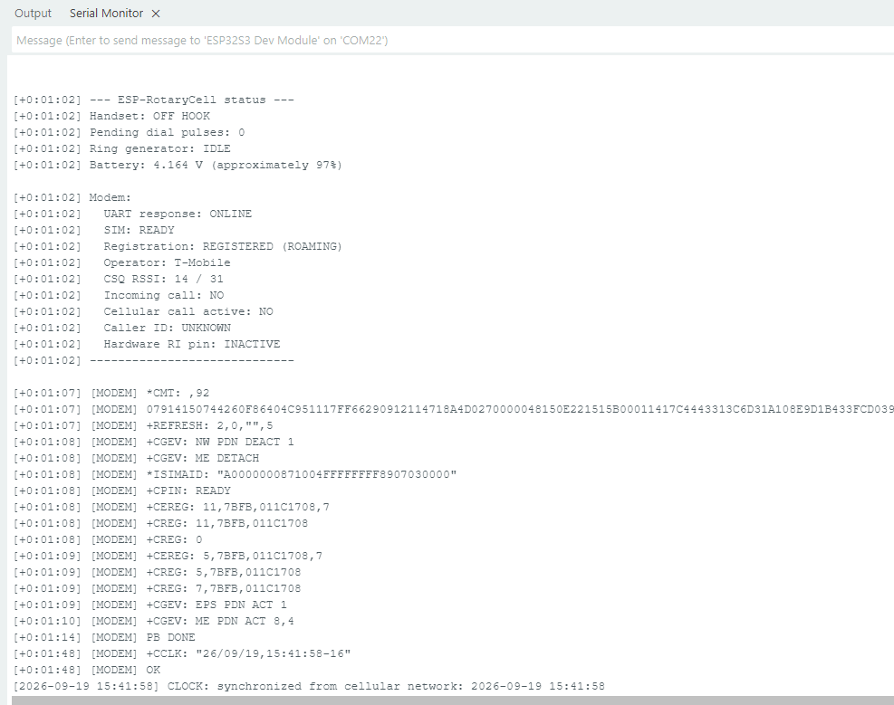
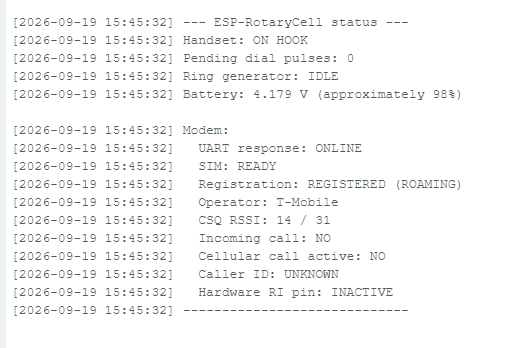

RotaryCell / build guide

# Upload the firmware

The first installation is made through the LilyGO's **ESP-USB** connector using
Arduino IDE. The modem's USB connector is not used for this step. Once a full
image has been installed, later application updates can also be loaded through
the maintenance web page.

This walkthrough uses Arduino IDE 2.3.10, Espressif's ESP32 Arduino core
**3.3.11**, and the `ESP32S3 Dev Module` target. The RotaryCell sketch uses only
libraries supplied with that ESP32 core, so no additional Arduino libraries
are required.

## 1. Install the ESP32 board package

Install Arduino IDE 2.x, open **Tools → Board → Boards Manager**, and install
version **3.3.11** of **esp32 by Espressif Systems**.

Download the
[`ESP-RotaryCell_v0.11.1-dev` guide-firmware ZIP](downloads/ESP-RotaryCell_v0.11.1-dev-source.zip),
extract it and open the `.ino` file from the complete versioned folder. Arduino
IDE should show the other `.cpp` and `.h` files as tabs alongside the sketch;
keep the whole folder together.

This is the **required firmware for the illustrated PCB build**. It implements
the GPIO35 hardware reset and GPIO21 AG1171 power control used by the guide.
The repository still retains v0.10.4 as the earlier stable firmware, but that
release predates those two connections and is not the correct choice for this
build.

## 2. Connect the controller

Connect a data-capable USB cable to the LilyGO port marked **ESP-USB**. Select
the new serial port in Arduino IDE, then choose **ESP32S3 Dev Module** as the
board.

Use these settings under **Tools**:

| Setting | Selection |
| --- | --- |
| USB CDC On Boot | Enabled |
| CPU Frequency | 240 MHz (WiFi) |
| Core Debug Level | None |
| USB DFU On Boot | Disabled |
| Erase All Flash Before Sketch Upload | Disabled |
| Events Run On | Core 1 |
| Flash Mode | QIO 80 MHz |
| Flash Size | 16 MB (128 Mb) |
| JTAG Adapter | Disabled |
| Arduino Runs On | Core 1 |
| USB Firmware MSC On Boot | Disabled |
| Partition Scheme | Minimal SPIFFS (1.9 MB APP with OTA / 128 KB SPIFFS) |
| PSRAM | Disabled |
| Upload Mode | UART0 / Hardware CDC |
| Upload Speed | 921600 |
| USB Mode | Hardware CDC and JTAG |
| Zigbee Mode | Disabled |

## 3. Compile and upload

Click **Verify** first. A successful build ends with the program-storage and
dynamic-memory summaries rather than an error message.

Click **Upload**. Arduino IDE compiles again, connects to the ESP32-S3, writes
the image and verifies it. Wait for both `Hash of data verified` and
`Hard resetting via RTS pin` before disconnecting anything.

## 4. Watch the first boot

Open **Tools → Serial Monitor**, select **115200 baud**, and set the line ending
to **Both NL & CR**. The controller should report the handset state, start the
A7670G interface and print the console command list.

The modem may take roughly a minute to initialize and register. Network events
will continue to appear in the Serial Monitor. Once network time is available,
the log changes from elapsed-time stamps such as `[+0:01:02]` to dated stamps.

Enter `S` and press **Send** for a complete status report. A ready installation
should show:

- the correct on-hook or off-hook handset state;
- `UART response: ONLINE`;
- `SIM: READY`;
- a registered cellular state and an operator name; and
- a plausible battery voltage.

The firmware can be uploaded with USB power alone, but the finished telephone
cannot be tested that way. The AG1171 carrier is supplied from the LilyGO's
battery path, so connect the battery before testing hook detection, rotary
dialing, ringing or audio.

At the console, `?` prints the available commands, `P` enables verbose rotary
pulse display, and `WIFI` opens the maintenance Wi-Fi without using the dial.
