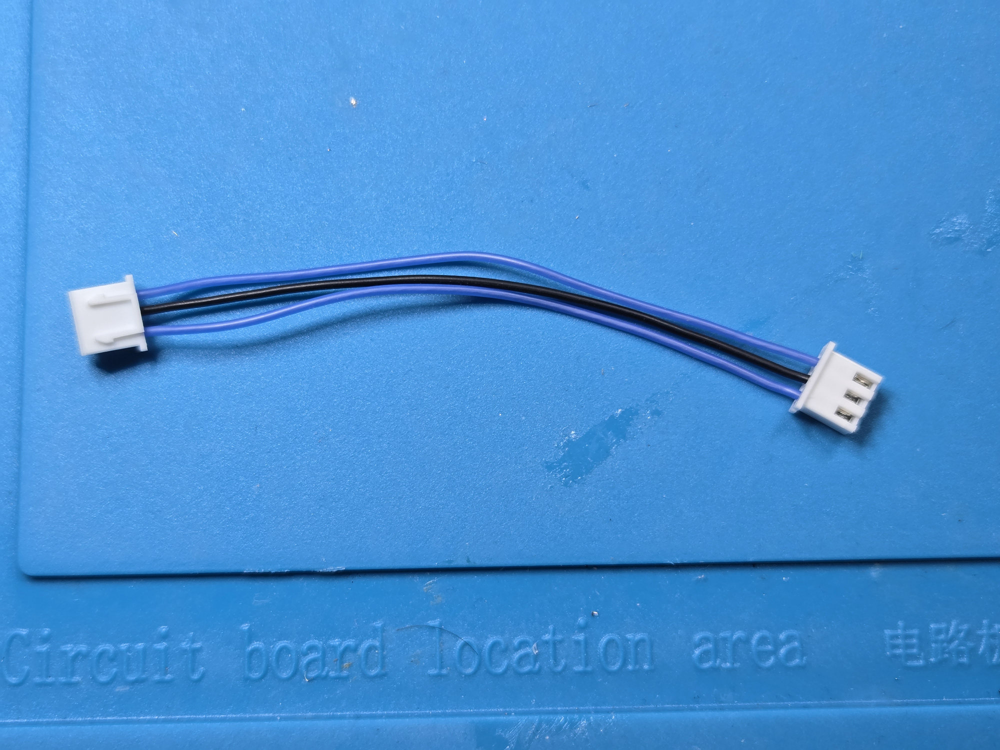
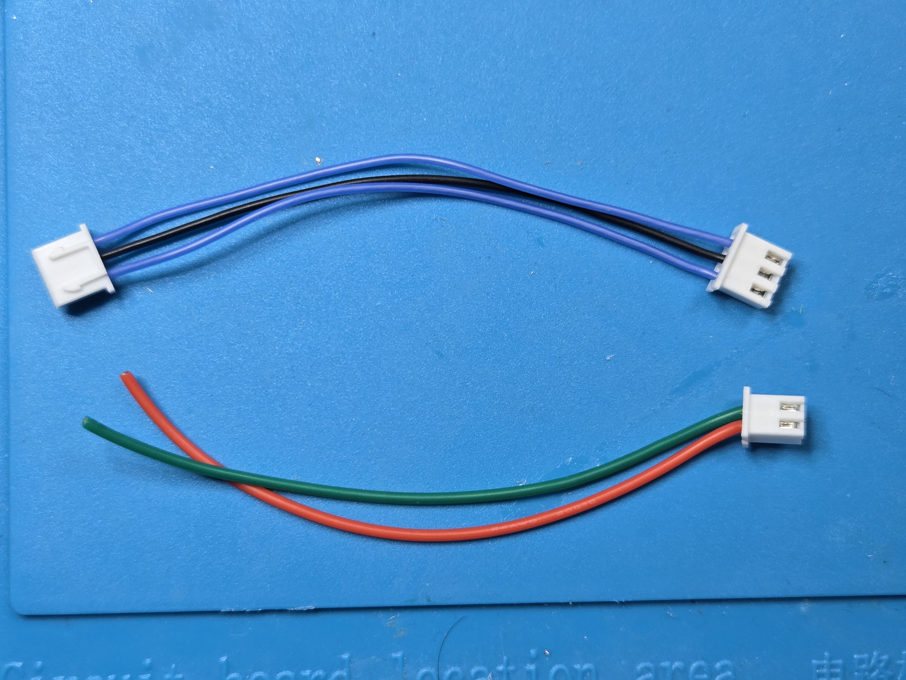

RotaryCell / build guide

# Prepare the cables

This page records the cable lengths, colors and pin assignments used in the
working build. It assumes you already know how to strip wire and crimp the
contacts correctly.

!!! note "Wire colors are not part of the circuit"
    You do not need to copy my wire colors or follow the same overall color
    scheme. I used a combination of what I had available and what helped me
    keep the wiring straight. Use colors that let you distinguish conductors
    wherever polarity, connector orientation or signal identity matters, and
    record any substitutions you make.

## Audio board to carrier

Use a 10 cm three-conductor cable between Audio A4 J2 and carrier U2. It is
wired straight through, with blue outer conductors and black in the center.

| Audio A4 J2 | Carrier U2 | Signal |
| --- | --- | --- |
| Pin 1 | Pin 1 | VIN |
| Pin 2 | Pin 2 | GND |
| Pin 3 | Pin 3 | VOUT |

## Carrier to telephone network

The two-position `NETWORK` connector on the carrier runs to the telephone's
network block. Use **green for tip** and **red for ring** so the original
telephone convention remains obvious during installation. Leave the network
block ends untrimmed until the boards are in the phone.

## Remaining harnesses

I use this [crimp tool and connector kit](https://www.amazon.com/dp/B0C8N77PFF) for the harnesses. The kit also supplies the through-hole headers for the boards.

The four charging, battery, AG1171 power and AG1171 signal harnesses use 10 cm
conductors. Current-carrying red, yellow and black conductors are 24 AWG, while
signal-only conductors are 28 AWG. The three-wire hardware-reset harness uses
16 cm red and yellow 24 AWG conductors and an 18 cm green 28 AWG trigger wire.
The LilyGO audio harness uses 28 AWG wire: 14 cm black common, 18 cm blue tone,
and 10 cm red `SPEK+` and `MIC+` leads. Both two-position audio cables begin at
10 cm; remove the black `SPEK-` conductor and trim the black `MIC-` conductor
during final soldering.

!!! warning "Check both ends of the audio harness"
    Do not use the connector shells alone to judge wire order. Compare the
    signal at every position on the LilyGO end with the matching Audio/Reset A4
    pin. A housing can plug in normally even when its conductors were inserted
    in reverse order.

## Check the finished cable

Verify every conductor end-to-end and check for unintended connections between adjacent pins. Gently check that each contact is retained by its housing.

!!! note "Connector names repeat"
    Audio A4 U2 is the reset connector. Carrier U2 is the audio connector. Always include the board name when checking a connection.
