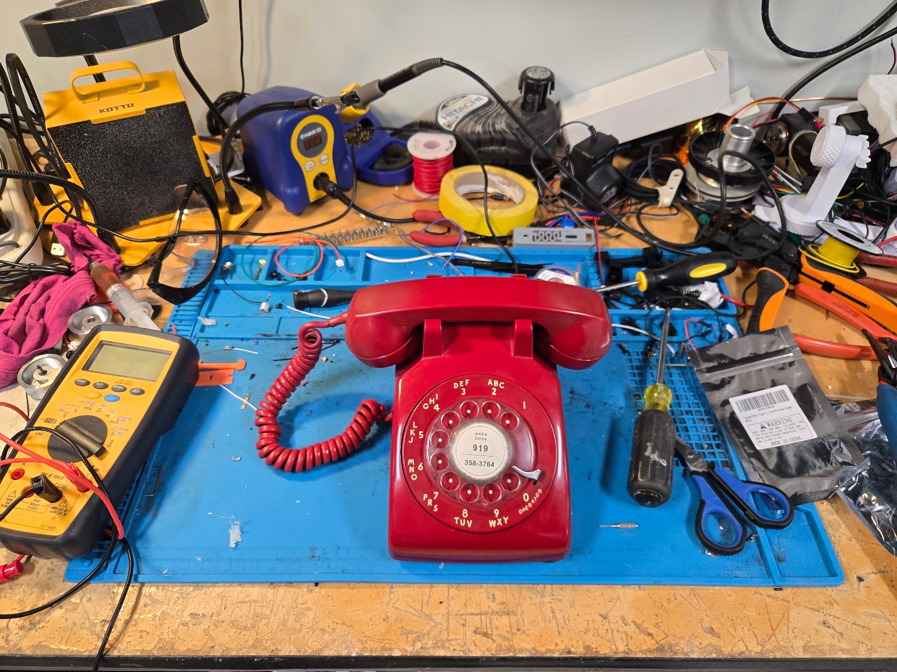

  

    The RotaryCell build guide
    <h1>Convert a rotary phone for cellular service.</h1>
    
Build the electronics, prepare the wiring, load the firmware and install RotaryCell in a Western Electric 500-series telephone.

    <a href="materials.html" class="md-button md-button--primary">Start with materials →</a>
  

  

    
    A completed RotaryCell conversion
  

  <section>
    Before you begin
    <h2>Experience expected</h2>
    
This is not an introductory electronics project. You should be comfortable soldering and desoldering, crimping small contacts, following pinouts and checking your work with a multimeter.

  </section>
  <section>
    A note on the photos
    <h2>Several phones, one guide</h2>
    
The photographs were taken across several builds. Shell colors, network blocks, original wiring and routing vary. Follow labels and written connections; use the photos for orientation and clearance. Wire colors only matter where the text assigns them a function.

  </section>

## Build sequence

Follow the project in order from sourcing through the first call. Preparing the
LilyGO contains nearly all of the fine soldering and accounts for roughly
**80% of the hands-on assembly**. The work becomes much more straightforward
after that stage.

  <a class="journey-step" href="materials.html">01<strong>Materials and sourcing</strong><small>Choose the parts, order the boards and prepare your tools.</small>→</a>
  <a class="journey-step featured" href="lilygo.html">02<strong>Prepare the LilyGO <em>Most of the hands-on work</em></strong><small>Remove the original holder and add the battery, audio, power and control connections.</small>→</a>
  <a class="journey-step" href="assembly.html">03<strong>Boards and wiring</strong><small>Populate the carrier, prepare the cables and assemble the battery leads.</small>→</a>
  <a class="journey-step" href="firmware.html">04<strong>Firmware and SIM</strong><small>Load the software and establish cellular service.</small>→</a>
  <a class="journey-step" href="mounting.html">05<strong>Install and adjust</strong><small>Mount everything, connect the phone and set the audio.</small>→</a>
  <a class="journey-step" href="checks.html">06<strong>Final checks</strong><small>Check calling, ringing and battery operation.</small>→</a>

The guide follows the LilyGO controller, Audio/Reset A4 board and AG1171
carrier installed in a Western Electric Model 500 telephone.
