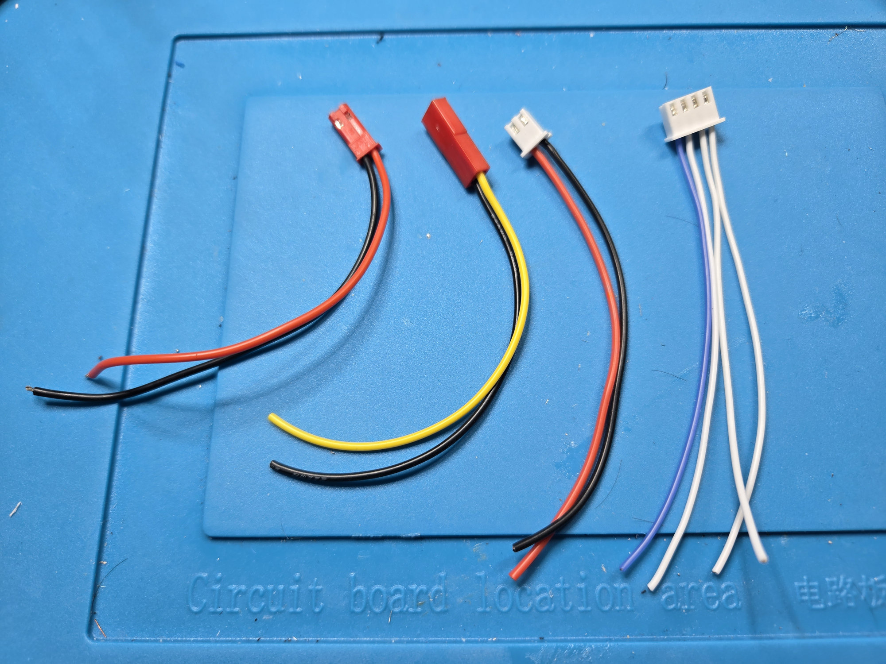
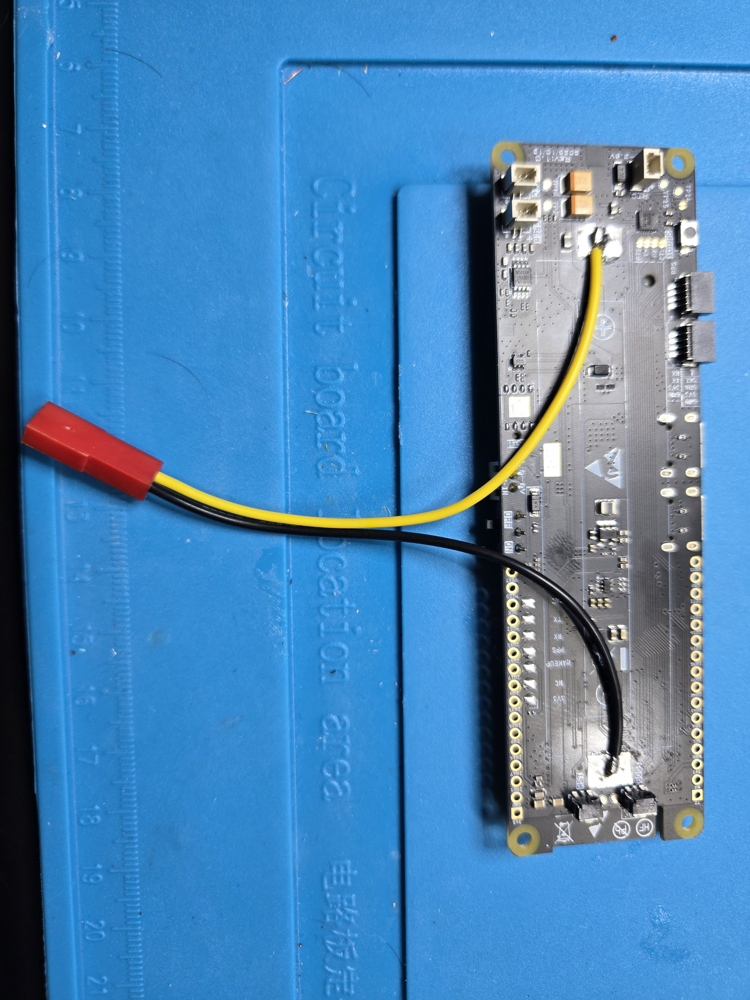
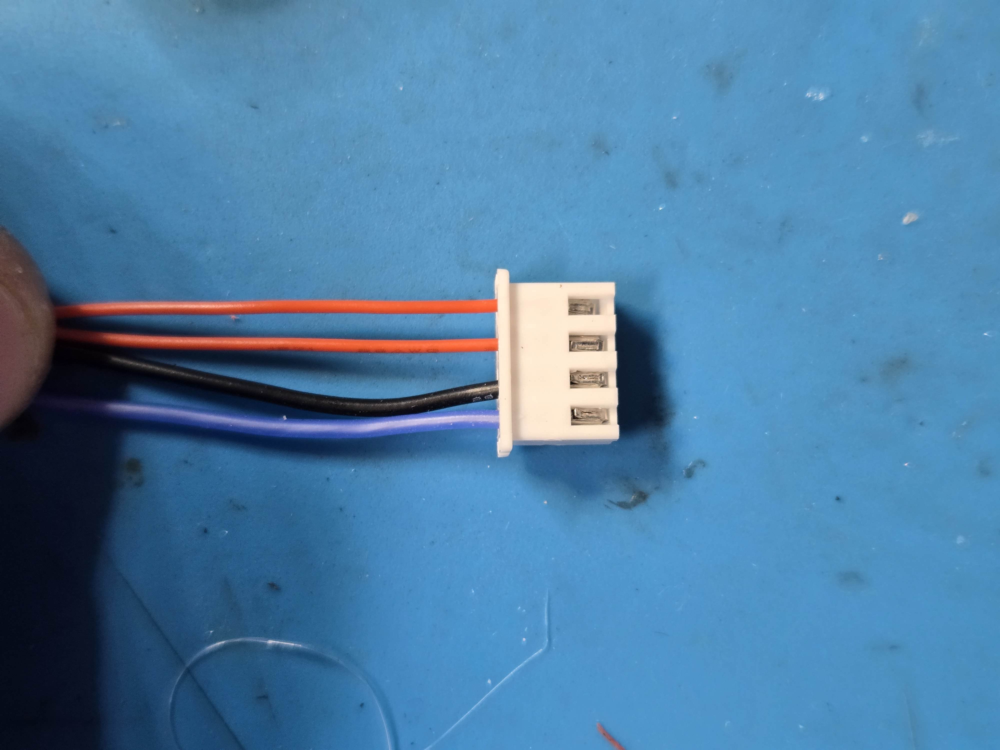
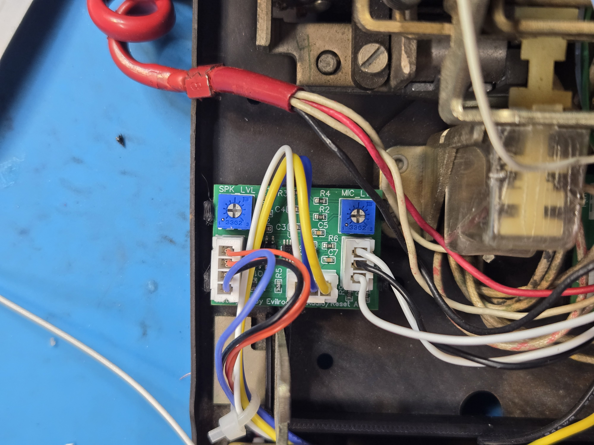
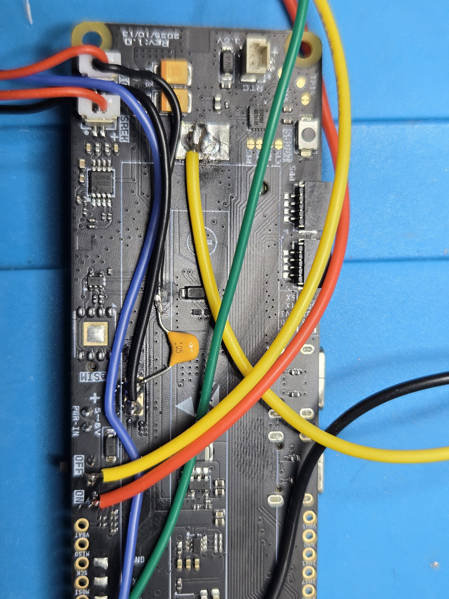
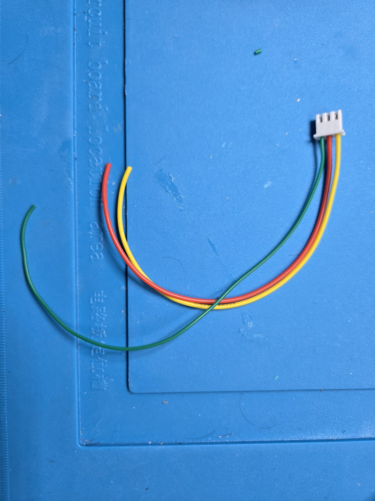
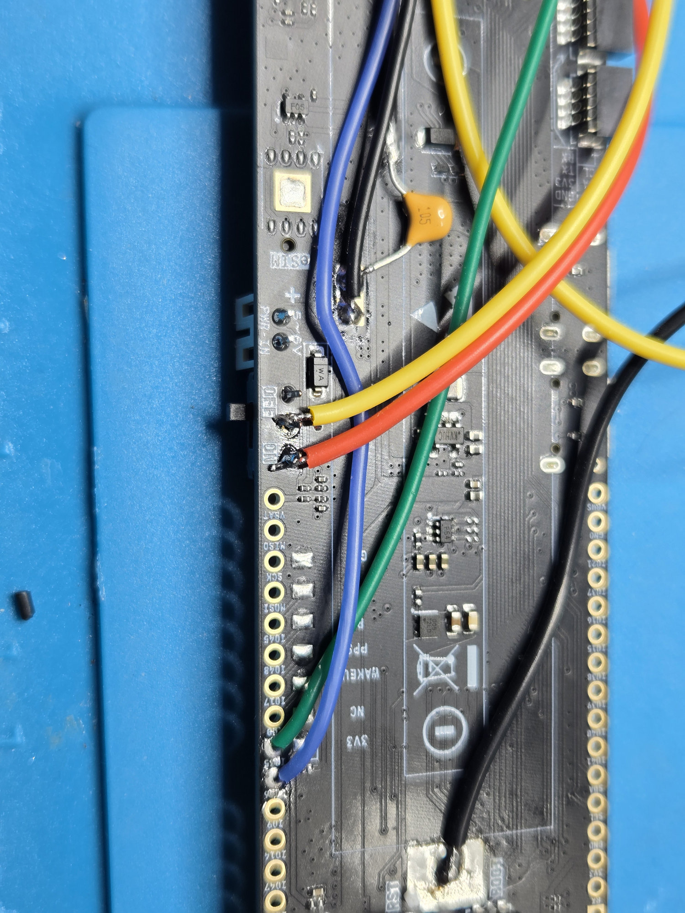
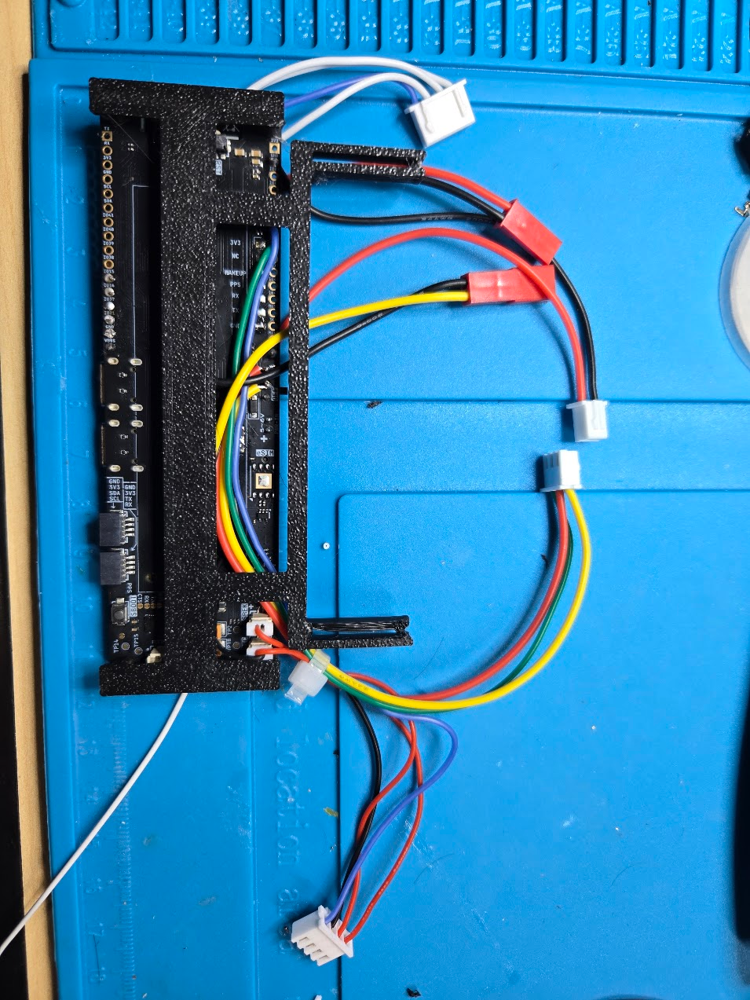

RotaryCell / build guide

# Add the LilyGO connections

Add and label each group separately. The overview and close photographs below
show the connector orientation and routing used in the working build.

Four harnesses attach to the LilyGO. From left to right in the photograph:

| Harness | Wire identification used in this build |
| --- | --- |
| Charging input | 10 cm red and black pair with red two-position connector |
| 21700 battery | 10 cm pair; yellow is unswitched battery positive and black is battery negative |
| AG1171 carrier power | 10 cm red and black pair with white two-position connector |
| AG1171 carrier signals | Four 10 cm signal wires in a white connector; the blue conductor marks orientation |

Throughout this build, **black is negative** and **yellow identifies unswitched
battery positive**. The blue wire in the four-conductor signal harness is an
orientation marker; compare its position with the completed-board photographs
before inserting the contacts into the housing.

The current-carrying red, yellow and black conductors shown here are 24 AWG.
The signal-only conductors are 28 AWG. These are the gauges used in the working
build; the signal currents themselves are small.

## Battery and protected-system power

Connect the prepared 21700 leads to the LilyGO battery-positive and `BATN`
points formerly used by the holder. The AG1171 carrier receives positive power
from the LilyGO `VBAT` pad and returns through LilyGO **system GND**. Its ground
does not connect directly to `BATN`.

The yellow and black battery leads leave opposite ends of the former holder
area. Keeping both at 10 cm provides enough lead to reach the 21700 without
leaving a large loop inside the phone.

## Audio and tone

The Audio/Reset A4 harness uses GPIO36 for generated telephone tones, common
ground, `SPEK+` and `MIC+`.

- Leave `SPEK-` insulated and floating.
- Connect `MIC-` to system ground through the external nonpolar 1 µF
  capacitor used in the tested build.

<figure markdown>
  
  <figcaption>Viewed from the contact-window side, the corrected connector carries the GPIO36 audio signal, GND, <code>SPEK+</code> and <code>MIC+</code> from left to right. Identify each conductor by its termination rather than its color.</figcaption>
</figure>

The signal-only conductors in this harness are 28 AWG. Cut and prepare them as
follows:

| Connection | Color | Length | Preparation |
| --- | --- | ---: | --- |
| Common ground | Black | 14 cm | Leave loose for its LilyGO connection |
| GPIO36 tone | Blue | 18 cm | Leave loose for its LilyGO connection |
| `SPEK+` | Red | 10 cm | Installed in the two-position SPEK connector |
| `MIC+` | Red | 10 cm | Installed in the two-position MIC connector |
| `SPEK-` | Black | — | Remove this conductor from the SPEK cable |
| `MIC-` | Black | Start with 10 cm | Leave long initially; cut to fit when soldering the capacitor and ground connection |

Both audio connector branches begin as 10 cm cables. Removing the black
`SPEK-` conductor leaves the speaker connector intentionally one-sided. The
black `MIC-` conductor remains in its connector until the harness is installed,
then is trimmed to the required route.

<figure markdown>
  
  <figcaption>The same corrected harness installed at the top of the Audio/Reset A4 board. Check continuity by signal name from this connector back to the LilyGO before applying power.</figcaption>
</figure>

The close view shows the two audio connectors at the end of the controller and
the reference capacitor fitted before the wiring is dressed into the carrier.

## AG1171 control

The carrier logic harness uses GPIO15 for `FR`, GPIO16 for `RM`, GPIO37 for
`SHK`, and GPIO21 for `PD`. Record the connector orientation before inserting
the contacts into their housing.

The connector remains outside the controller outline while its individual
conductors follow the edge of the board. The 10 cm signal wires are long enough
to reach the carrier without adding unnecessary slack. Confirm all four
positions with a meter rather than inferring their order from wire colors.

## Hardware reset

Connect GPIO35 to the A4 trigger input. The other two A4 reset conductors attach
across the LilyGO physical power-switch path so the A4 board can remove and
restore battery power. The installed close-up below shows the two switch points
used for `RAW_BAT` and `SW_BAT` on the working assembly.

For the reset harness shown above:

| Wire | Length | Gauge | Purpose |
| --- | ---: | ---: | --- |
| Red | 16 cm | 24 AWG | Power-switch path |
| Yellow | 16 cm | 24 AWG | Power-switch path |
| Green | 18 cm | 28 AWG | Reset trigger signal |

The extra 2 cm on the green trigger wire allows it to follow the required route
without pulling against the two power-switch conductors.

The red and yellow conductors start at the two switch points. The longer green
trigger lead starts farther down the controller and joins them after following
the board edge, which accounts for its additional 2 cm.

## Charging

Bring regulated 5 V from the selected rear connector to the LilyGO charging
input and system ground. Keep this charging input separate from the AG1171
carrier's battery supply.

Arrange and strain-relieve the new wiring so both USB ports and both QWIIC
connectors remain accessible.

## Dress the wiring into the carrier

Seat the LilyGO fully in the printed carrier. Route the audio, reset and control
conductors through its open channel so they leave together near their
destination boards. The shorter power and connector leads only need to clear
the carrier edge. Nothing should cross a USB port, press on the power switch or
pull against a solder joint when the carrier is set down.

<figure markdown>
  
  <figcaption>The prepared controller seated in the carrier. The loose connectors remain accessible for installation while the conductors pass through the carrier without loading the solder joints. Identify the audio conductors by GPIO36 audio signal, GND, <code>SPEK+</code> and <code>MIC+</code>, rather than by color.</figcaption>
</figure>
