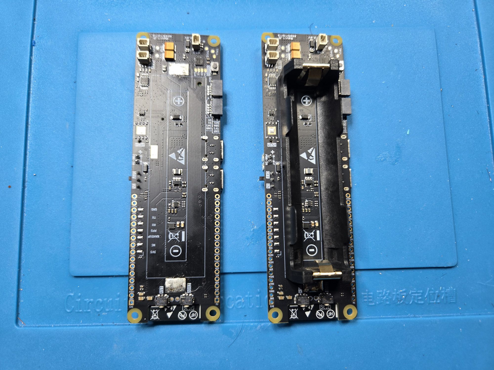
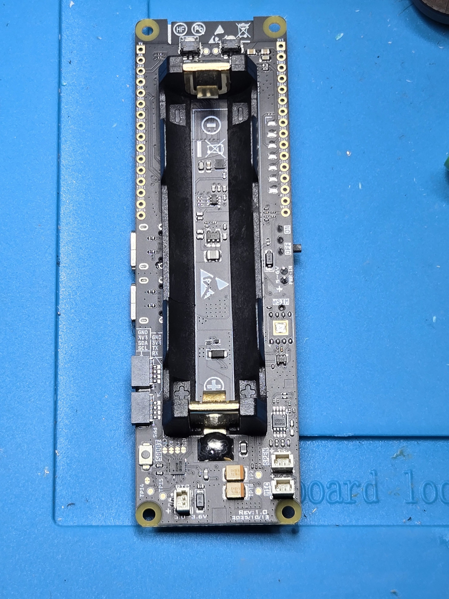
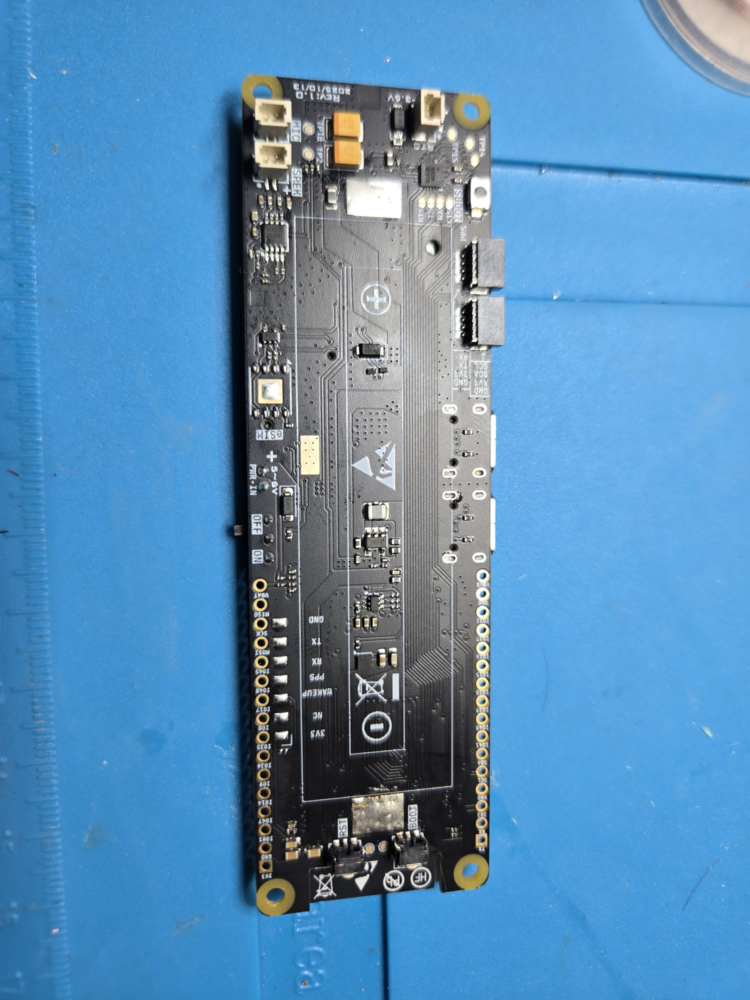

RotaryCell / build guide

# Remove the battery holder

The factory 18650 holder occupies the space needed by the finished RotaryCell
assembly. Its large solder joints conduct heat into the holder and board, so a
small USB-C iron is poorly suited to this step. I use a Hakko FX-888-series iron
with a broad tip, fresh solder, flux and desoldering braid.

<figure markdown>
  
  <figcaption>The original 18650 holder is shown on the right. The board on the left shows the space and battery contacts after the holder has been removed.</figcaption>
</figure>

## 1. Support the board

Place the LilyGO on a stable, heat-resistant surface without loading the modem,
USB connectors or small surface-mount parts. Note the holder orientation and
photograph both battery joints before applying heat.

The holder is retained by the large joints at its two ends. The photograph also
records the original polarity and holder orientation before any heat is
applied.

## 2. Clear the joints

Add flux and a small amount of fresh solder to improve heat transfer. Heat each
joint with the broad tip and remove solder with braid. Work a little at a time
rather than pulling against a joint that is still solid.

## 3. Lift the holder away

Remove the holder only when its attachment points move freely. Do not pry
against the PCB or use the copper pads as levers.

## 4. Clean and inspect

Remove remaining solder and flux as needed. Confirm that both battery pads are
flat, attached to the board and free of bridges or torn copper.

With the holder removed, inspect both former attachment areas and the exposed
board surface. The pads should remain attached and no neighboring components
should have moved.

<strong>Checkpoint</strong> Stop here if either pad lifted, a nearby component moved, or the board shows heat damage. Repair and verify the battery path before adding wires.

