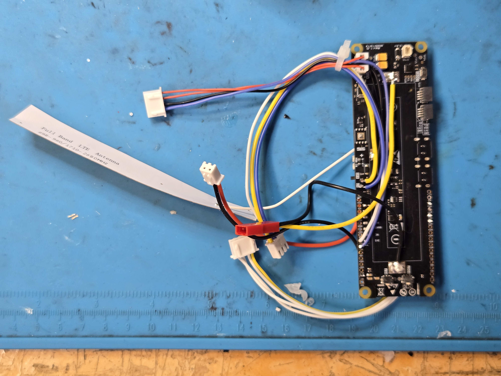

RotaryCell / build guide

# Prepare the LilyGO

Preparing the LilyGO is the difficult part of the build and represents roughly
**80% of the assembly work**. This is where the original battery holder is
removed and nearly all of the added wiring is soldered. Complete this stage on
the bench; once it is finished, most of the remaining build consists of fitting
components, plugging in harnesses and mounting the assemblies.

This stage removes the original 18650 holder and adds the connections for:

- the 21700 cell;
- AG1171 power;
- cellular audio and the generated telephone tones;
- AG1171 control and switch-hook sensing;
- the Audio/Reset A4 hardware power-cycle circuit; and
- the rear charging connector.

The prepared controller has its original 18650 holder removed and the battery,
power, audio, reset and control harnesses attached. The loose four-position
audio connector in this photograph has the corrected conductor order.

## Work in four passes

1. Photograph and label the untouched board.
2. Remove the factory 18650 holder and clean the battery pads.
3. Add the battery, power, audio and control connections.
4. Inspect and meter-test the completed controller before connecting the other boards.

The finished arrangement should keep both USB ports and both QWIIC connectors
reachable. Optional INA226 and microSD instrumentation is not part of the
standard build.

<strong>Before continuing</strong> Disconnect the battery, USB cables and every external board. The LilyGO should be completely unpowered while the holder is removed and the new wiring is installed.

