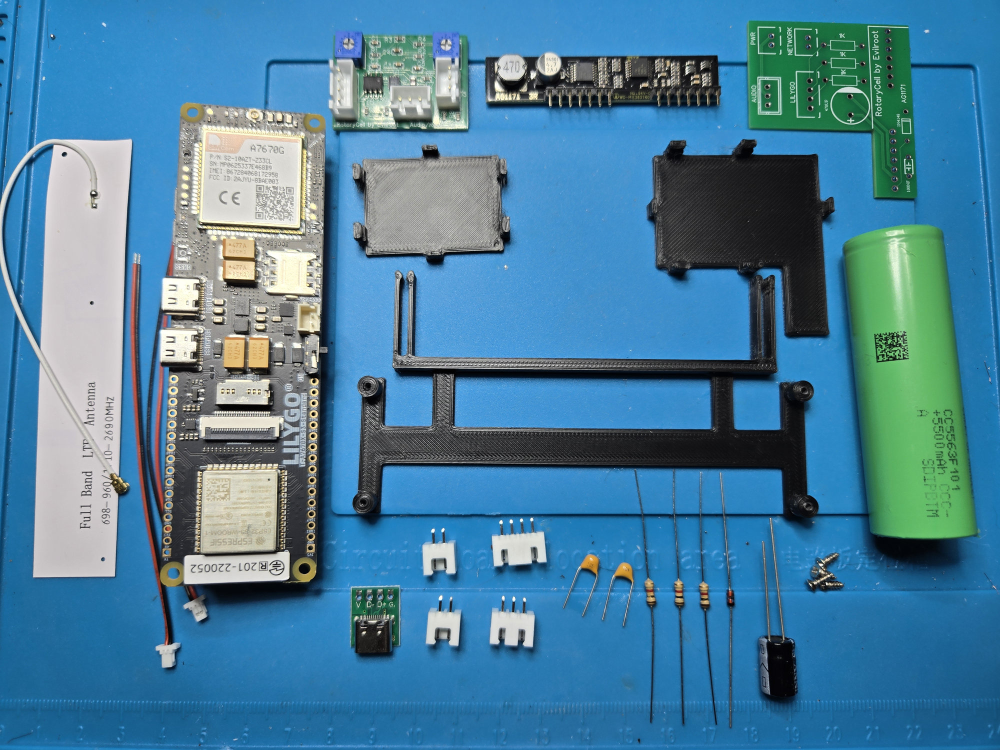

RotaryCell / build guide

# Bill of materials

This is the hardware used for one RotaryCell conversion. Prices are in US
dollars and are reference prices checked in September 2026. They will change
with stock, sales, shipping and tariffs, so confirm each listing before
ordering.

## Major parts for one phone

| Part | Qty. | Source | Reference price | Notes |
| --- | ---: | --- | ---: | --- |
| LilyGO T-SIM7670G-S3 Standard | 1 | [Exact LilyGO board and option](https://lilygo.cc/en-us/products/t-sim-t-a-series-standard-edition?variant=52513685799093) | **$29.32** | Price observed September 16, 2026. Use the Standard version selected by the link. |
| Audio/Reset A4 and AG1171 carrier PCBs | 1 set | [Board files and ordering instructions](ordering.md) | **$8.92 per set** before delivery | JLCPCB order of five sets was $44.62. The same order worked out to $11.19 per set with slower shipping or $19.69 per set with DHL DDP and the tariffs shown at checkout. |
| Silvertel AG1171 module | 1 | [Digi-Key 5061-AG1171-ND](https://www.digikey.com/en/products/detail/silvertel/AG1171/21187236) | **$8.50** | Installs on the hand-populated carrier PCB. |
| Samsung 58E 21700 cell | 1 | [18650 Battery Store](https://www.18650batterystore.com/products/samsung-58e-21700-battery) | **$4.99** | Flat-top, unprotected 5330 mAh cell. Add spot-welded tabs; do not solder directly to the cell. |
| Printed interior mounts | 1 set | [Download the STL files](printed-parts.md) | **Filament cost only** | Three PLA parts: LilyGO carrier, Audio/Reset carrier and AG1171 carrier. |
| USB-C rear connector board | 1 | [Amazon 20-pack used here](https://www.amazon.com/dp/B0CB395L99) | **$9.49 for 20; about $0.47 each** | Only `V+` and `GND` are used. This board lacks USB-C PD request resistors, so use a USB-A-to-USB-C cable. |
| Activated voice SIM | 1 | [SpeedTalk physical SIM used here](https://www.amazon.com/dp/B07G9P5ZBW) | **About $5 including the first 30 days** | Ongoing service is a recurring cost. Another activated physical SIM may work if it provides compatible cellular voice service. |
| Donor rotary telephone | 1 | Existing phone or local seller | **Varies** | The guide is based on Western Electric 500-series telephones. Network blocks and internal wiring differ by revision. |

The AG1171 carrier also needs a handful of inexpensive resistors, capacitors,
a diode and headers. Use the exact [through-hole parts list](digikey-parts.md)
rather than treating the simplified table above as a placement BOM.

<figure markdown>
  
  <figcaption>The principal electronic and printed parts for one RotaryCell. Wire, crimp contacts, connector housings and phone-specific rear-connector hardware are not shown.</figcaption>
</figure>

## What one set costs

Using the prices above, the LilyGO, one pre-shipping PCB set, AG1171, battery
and one USB-C breakout total **$52.20 per phone**. Using the slower delivered
PCB figure raises that core subtotal to **$54.47**. Adding the approximately $5
SIM makes it about **$59.50 before** the donor phone, small carrier components,
printed plastic and shipping from the other suppliers.

The board order has the largest up-front mismatch: JLCPCB supplies five sets.
The example order was **$55.93 delivered by the slower method**, or **$98.47 by
DHL DDP with the quoted tariffs**, even though one phone consumes only one set.
The remaining four sets can be used for additional phones.

## Shared purchase for wiring

| Item | Source | Reference price | What it covers |
| --- | --- | ---: | --- |
| Crimp tool and connector assortment | [SOMELINE JST-XH/SM/SYP and Dupont kit](https://www.amazon.com/dp/B0C8N77PFF) | **$39.98** | Tool, crimp contacts, housings and the through-hole headers used by the boards; one kit supports many builds. |
| 24 AWG and 28 AWG stranded wire | Electronics supplier of your choice | **Varies** | Power leads use 24 AWG; signal-only leads use 28 AWG. Buying several colors makes assembly easier, but signal names determine the connections. |
| External 1 µF capacitor | [Murata RDER71H105K2M1H03A at Digi-Key](https://www.digikey.com/en/products/detail/murata-electronics/RDER71H105K2M1H03A/4771301) and [through-hole parts list](digikey-parts.md) | **$0.69 each** | Nonpolar radial ceramic capacitor used in the microphone reference connection. |
| VHB tape, heat-shrink and hot glue | General shop supplies | **Varies** | Mounting, insulation and strain relief. |

The crimp kit is a reusable tool and assortment, so its full purchase price is
not included in the per-phone subtotal.

## Bench tools

You will also need a temperature-controlled soldering iron, solder, flux,
desoldering braid, flush cutters, wire strippers, a multimeter and a way to
spot-weld battery tabs. These are shop tools rather than parts consumed by one
telephone.

I use a [Hakko FX-888-series soldering station](https://www.amazon.com/Hakko-FX888DX-010BY-Digital-Soldering-Station/dp/B0D4DJW54S)
with an [assortment of compatible tips](https://www.amazon.com/Replacement-Soldering-FX-888D-FX-888-FX-8801/dp/B076QDTVXG).
A broad tip and the available heat are particularly useful when removing the
LilyGO's original battery holder; the small USB-C irons I tried could not keep
up with those heavier joints.

## Next steps

- [Review the individual through-hole components](digikey-parts.md).
- [Order the two custom circuit boards](ordering.md).
- [Print the mounting parts](printed-parts.md).
