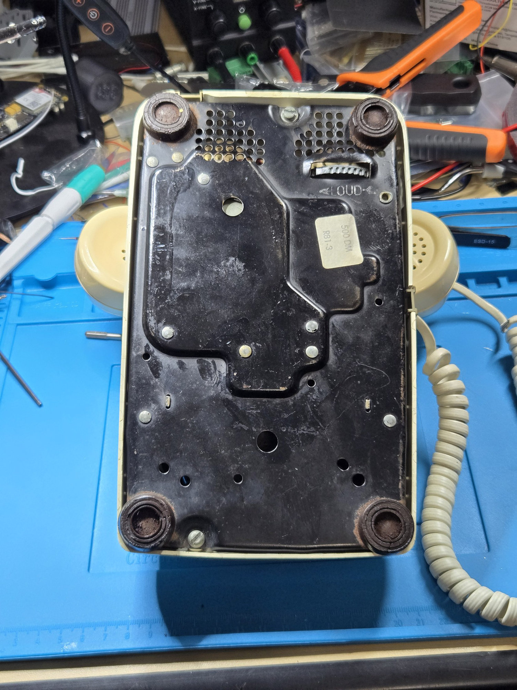
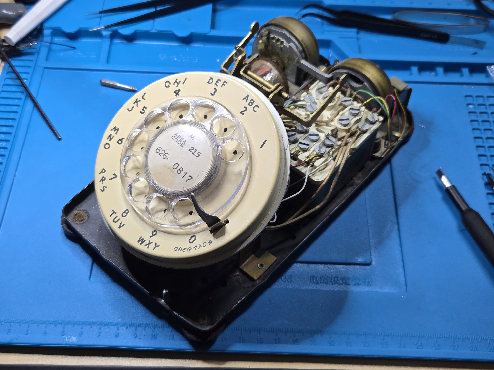
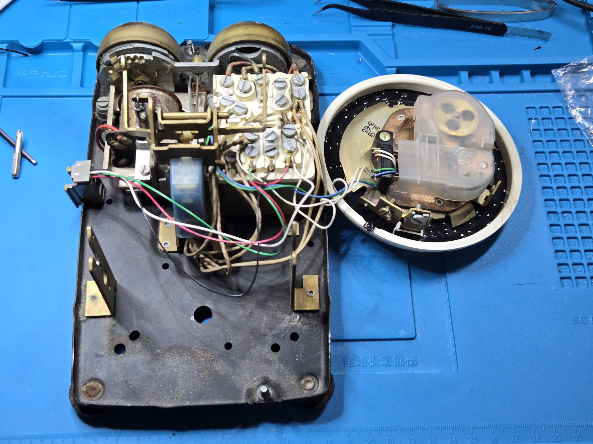
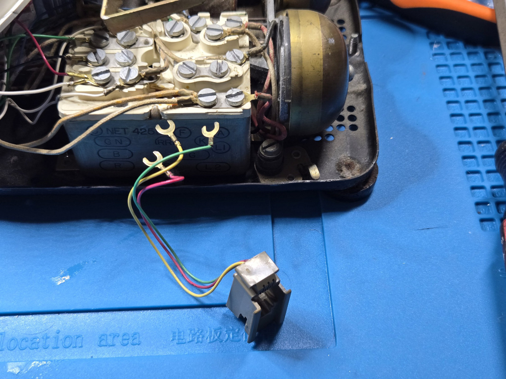
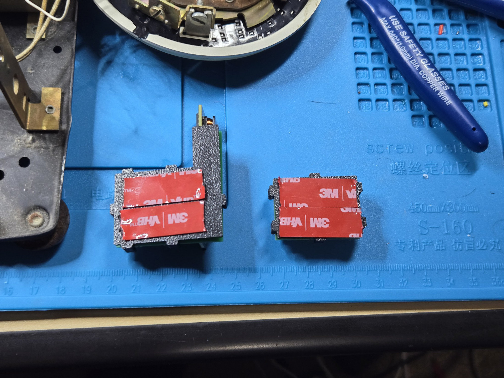
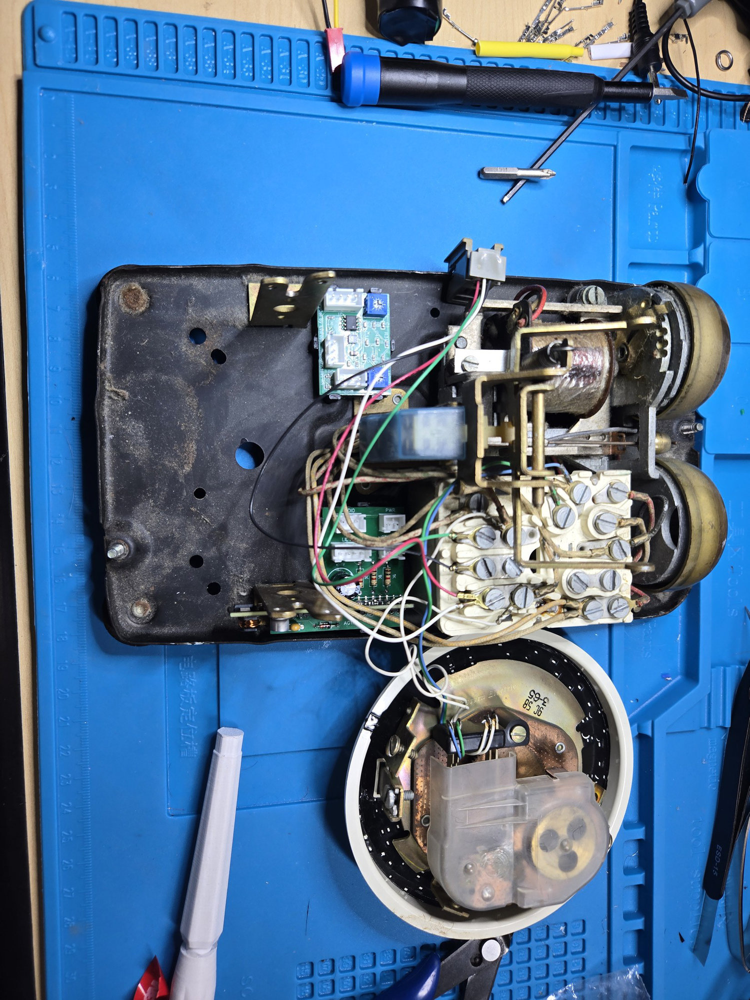
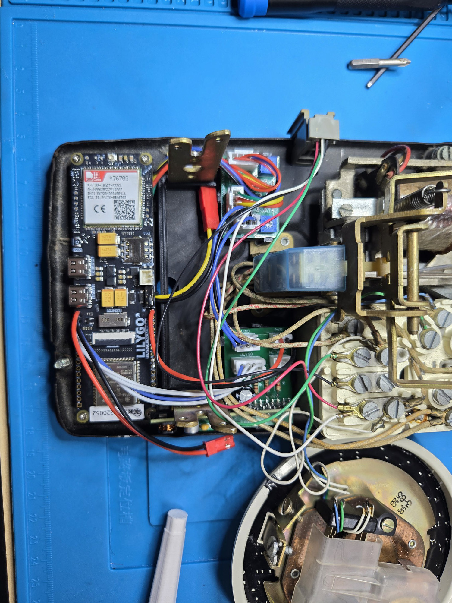
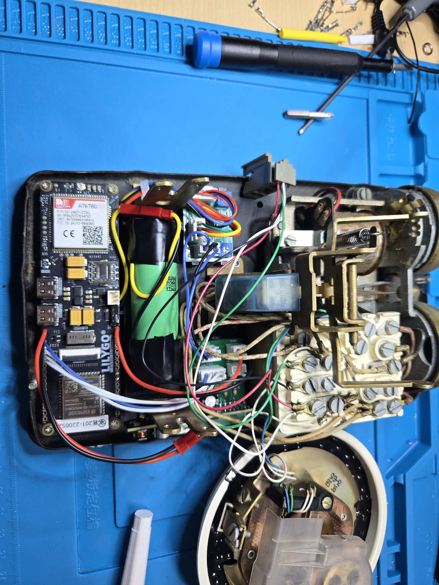
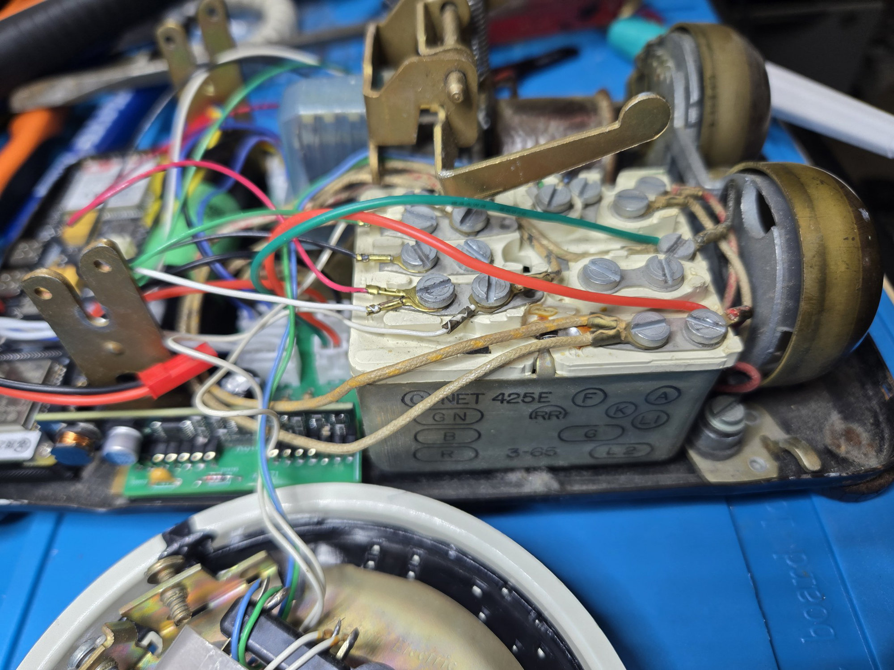

RotaryCell / build guide

# Install the assemblies

The telephone shown here is a Western Electric Model 500. Take a clear photograph of its original wiring before moving anything; wire colors and earlier repairs vary from phone to phone.

## 1. Open the telephone

Turn the phone over and loosen the two housing screws shown below. Lift off the shell without pulling on the wiring.

Loosen the two flathead screws that retain the dial assembly, one on each mounting post. Back both screws out a good distance, but do not remove them completely. Lift the dial assembly free of the posts and move it aside far enough to expose the base. Leave its original wiring attached and avoid hanging its weight from the wires. Close-up photographs of these screws appear later when the dial is reinstalled.

## 2. Free the rear-connector wiring

The original modular jack in this phone used four spade lugs on the network block. Photograph their locations, then disconnect them so the network terminals and rear opening are available for the RotaryCell installation. The next page covers the available rear-connector options.

## 3. Fit the board carriers

Apply 3M VHB tape to the underside of the two small printed carriers as shown. Press them onto the metal base in the positions shown in the following photograph.

Fit the LilyGO and its printed carrier along the open left side of the base. Plug in the prepared harnesses while the connectors are still easy to reach.

## 4. Add the battery and telephone connection

Place the insulated 21700 between the LilyGO and the upper board. The lead lengths are intentionally different so the connectors reach their boards without leaving large coils of wire in the phone.

Connect the carrier's two-wire `NETWORK` harness to the original telephone network block. Green is tip and red is ring; the photograph shows the two terminals used in this build.

At this stage all three boards and the battery should sit below the dial mechanism, with the wiring lying inside the perimeter of the base. Leave the dial loose until firmware, calling and audio tests are complete.
