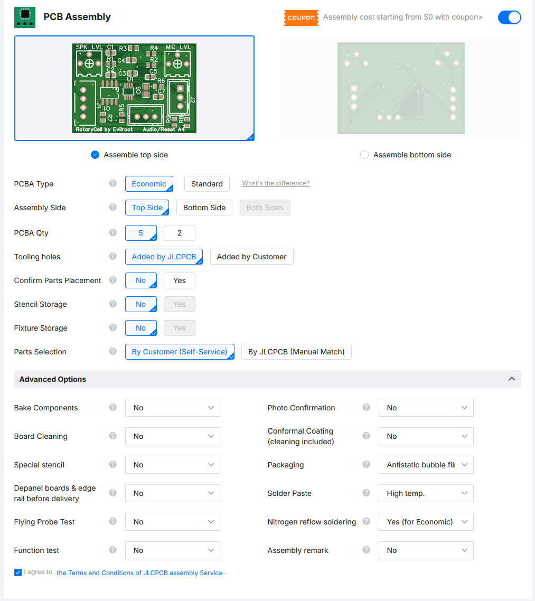
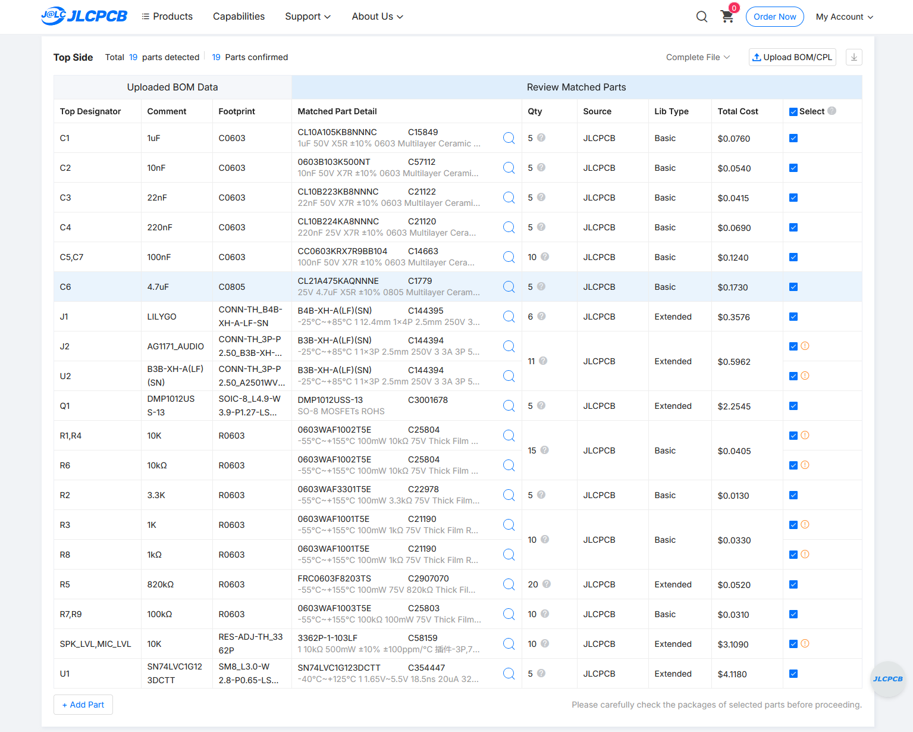
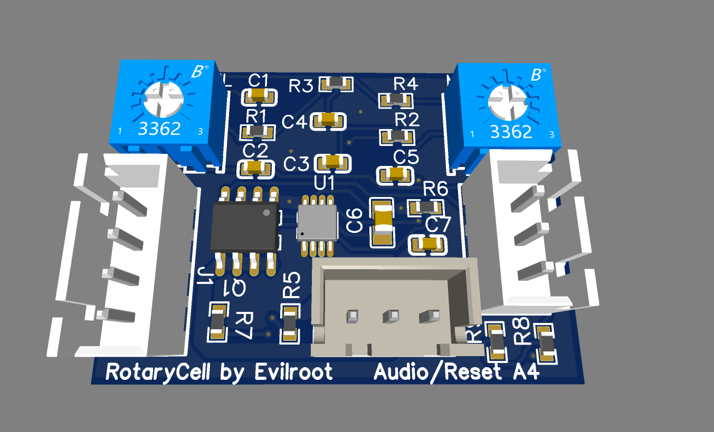
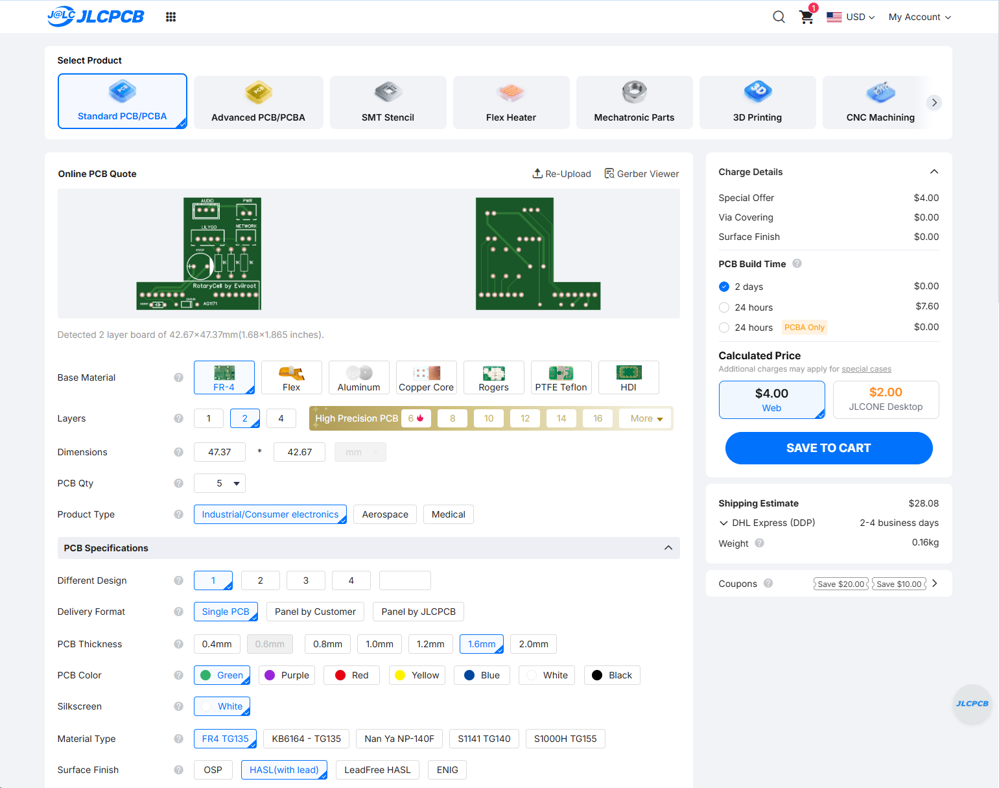
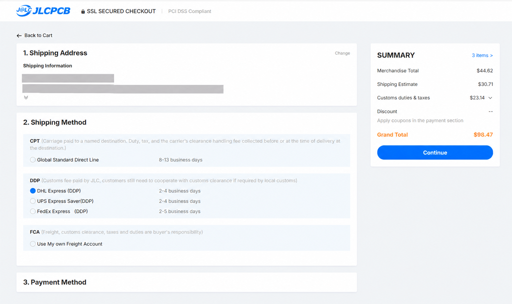

RotaryCell / build guide

# Order the PCBs

RotaryCell uses two custom boards:

- an **Audio/Reset A4** board ordered fully assembled; and
- a bare **AG1171 carrier** populated by hand, like Neanderthals.

JLCPCB has a five-board minimum, so one order produces five complete board
sets. That sounds more expensive than it really is: the boards for this order
were **$44.62 total, or about $8.92 per set**, before shipping and tariffs. A
set here means one assembled Audio/Reset board and one bare AG1171 carrier; it
does not include the AG1171 module or the carrier's through-hole components.

## Download these files

Upload the Gerber ZIP files directly. Do not extract them.

| Board | Production files |
| --- | --- |
| Audio/Reset A4 | [Gerbers](https://github.com/fregacmols/RotaryCell/raw/refs/heads/main/hardware/audio-reset-a4/ESP-RotaryCell_Audio-Reset_RevA4_Gerbers.zip) · [BOM](https://github.com/fregacmols/RotaryCell/raw/refs/heads/main/hardware/audio-reset-a4/ESP-RotaryCell_Audio-Reset_RevA4_BOM.csv) · [Pick and place](https://github.com/fregacmols/RotaryCell/raw/refs/heads/main/hardware/audio-reset-a4/ESP-RotaryCell_Audio-Reset_RevA4_PickAndPlace.csv) |
| AG1171 carrier | [Gerbers](https://github.com/fregacmols/RotaryCell/raw/refs/heads/main/hardware/ag1171-carrier-through-hole/ESP-RotaryCell_AG1171-Carrier_Through-Hole_2026-08-28_Gerbers.zip) |

## Audio/Reset A4

Upload its Gerber ZIP as a normal two-layer PCB. JLCPCB should detect a board
about **35.00 × 25.15 mm**. Use five 1.6 mm FR-4 boards with the ordinary
default copper weight and surface finish. I chose green solder mask and white
silkscreen.

You can, of course, order red solder mask instead. Everyone knows a red PCB
makes the firmware compile 300% faster.

Enable **Economic PCB Assembly**, select the **top side**, and assemble all five
boards. Upload the BOM and pick-and-place file when requested. The remaining
special-service options can stay at their defaults.

<figure markdown>
  
  <figcaption>The settings that matter: economical assembly, top side and five boards.</figcaption>
</figure>

JLCPCB may group identical components under several designators and ask you to
confirm the combined quantities. Check that all designators are present. If a
part is out of stock, choose an electrically suitable replacement in the same
package. In this order C6 was replaced with another 4.7 µF 0805 ceramic
capacitor rated for 25 V; the higher voltage rating is harmless here.

<figure markdown>
  
  <figcaption>All 19 part groups confirmed after replacing the unavailable C6.</figcaption>
</figure>

Before adding it to the cart, compare the placement preview with this completed
board render. Pay particular attention to the keyed headers and two trimmers.

<figure markdown>
  
  <figcaption>The assembled Audio/Reset A4 board.</figcaption>
</figure>

## AG1171 carrier

Start a second PCB quote and upload its Gerber ZIP. JLCPCB should detect a
two-layer **47.37 × 42.67 mm** L-shaped board. Use the same basic board settings
and the five-board minimum, but leave **PCB Assembly off**. This one is soldered
by hand later.

<figure markdown>
  
  <figcaption>Check that both previews retain the complete L-shaped outline.</figcaption>
</figure>

## Shipping, tariffs and the actual per-set price

Compare shipping on the final checkout page rather than accepting the first
express estimate. This example produced the following totals for five sets:

| Checkout example | Order total | Cost per board set |
| --- | ---: | ---: |
| Boards before shipping | $44.62 | **$8.92** |
| $11.31 Global Standard Direct Line | $55.93 | **$11.19** before any later import charges |
| DHL DDP with shipping and tariffs | $98.47 | **$19.69 delivered** |

Global Standard Direct Line was listed as **CPT**, which means duties, taxes
and clearance fees may be collected later. The express options were **DDP** and
showed those costs at checkout. In this example DHL added $30.71 shipping and
$23.14 in customs duties and taxes.

<figure markdown>
  
  <figcaption>The DDP total makes both shipping and the $23.14 tariff charge visible.</figcaption>
</figure>

Tariffs are subject to the shifting whims of governments, so any figure printed
here may be obsolete by the time you reach checkout. Compare the live total and
the **CPT/DDP** label for your own order.

Before paying, make sure the cart contains both board designs, assembly is
enabled only for Audio/Reset A4, and every Audio/Reset part is confirmed.
