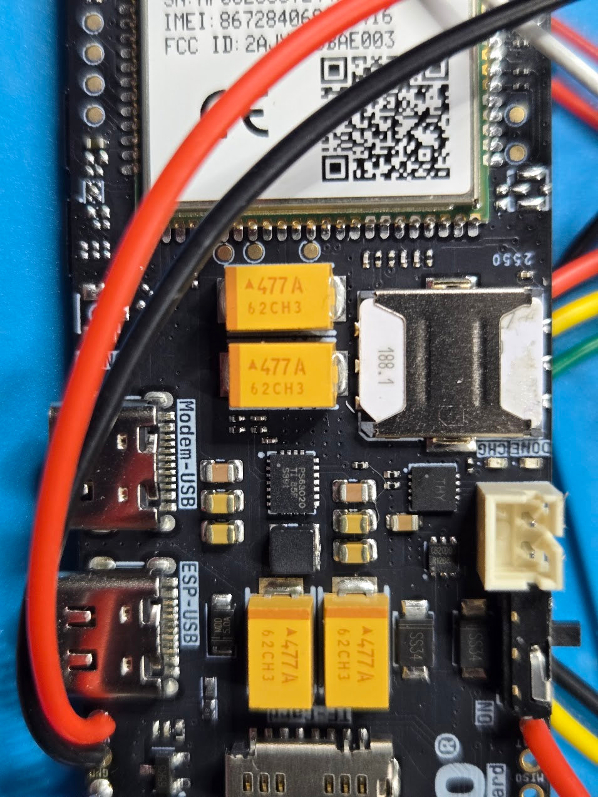

<span class="kicker">RotaryCell / build guide</span>

# Set up the SIM

This part was straightforward in my build. I used this inexpensive
[SpeedTalk Mobile physical SIM](https://www.amazon.com/dp/B07G9P5ZBW), activated
it on the provider's website with a new telephone number, put it in the LilyGO
and powered the board on. It registered and worked without any additional APN
or modem configuration.

The linked kit is a triple-cut SIM. Separate the nano-SIM section for the
LilyGO socket. The plan I selected includes voice minutes as well as small text
and data allowances. RotaryCell does not require a substantial data allowance
or a texting plan for ordinary telephone calls; voice service is the part that
matters.

## 1. Activate the line

Go to the provider's
[activation page](https://speedtalkmobile.com/activate/) and enter the SIM
number printed on the card. Choose a new telephone number or follow the
provider's porting procedure if you want to move an existing number. Complete
activation before installing the SIM.

Plans and prices change, so choose the least expensive current plan that still
includes ordinary cellular voice service and enough minutes for your use.

## 2. Install the SIM

Turn the LilyGO off. Insert the activated nano-SIM into the modem's SIM holder,
connect the cellular antenna and then power the controller. Do not insert or
remove the SIM while the board is powered.



## 3. Confirm registration

Open the Arduino Serial Monitor at **115200 baud** or use the maintenance web
console. During startup, look for:

```text
+CPIN: READY
```

Once the modem has joined the network, enter `S` at the console. The status
report should show `UART response: ONLINE`, `SIM: READY`, a registered cellular
state and the operator name. Registration may be reported as `REGISTERED
(ROAMING)` when the service provider is using another carrier's network; that
state worked normally in this build.


Finish with one outgoing and one incoming call. That verifies voice service,
the assigned telephone number and incoming-call routing rather than merely
confirming that the modem can see the network.

## Other SIMs

The SpeedTalk SIM is simply the one I bought and confirmed. Another activated
physical SIM should also work when its plan includes voice service, the carrier
supports the A7670G modem and its LTE bands, and there is compatible coverage
where the telephone will be used. A data-only or IoT SIM is not sufficient for
this project, and network registration alone does not prove that the carrier
will complete voice calls for the modem.
