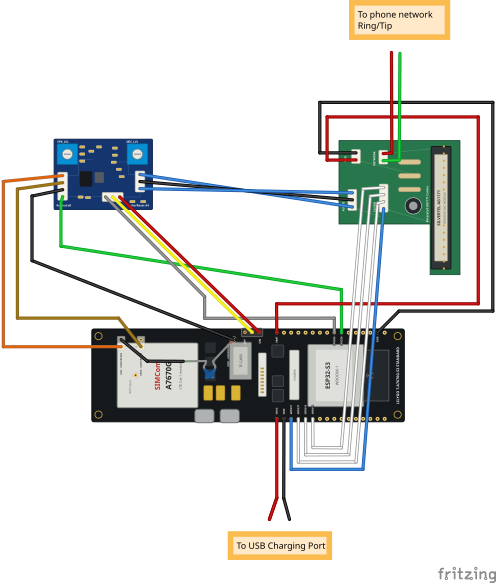

RotaryCell / build guide

# Complete wiring overview

Use this diagram as the connection map for the finished RotaryCell assembly. It
shows how the LilyGO controller, Audio/Reset A4 board, AG1171 carrier, charging
connector and telephone network connect before everything is fitted into the
phone.

<figure markdown>
  
  <figcaption>The complete electrical layout. Follow the printed terminal and GPIO labels when making each connection.</figcaption>
</figure>

!!! caution "Ring and Tip connections vary by telephone"
    The diagram shows the AG1171 `RING` and `TIP` outputs going to the telephone
    network, but it cannot show universal network-block terminals. Network
    blocks, terminal markings and factory wiring differ among telephone models
    and revisions. Use the schematic inside your telephone or trace the two
    points formerly connected to its incoming line cord. Do not choose
    terminals by wire color or by copying a photograph of a different phone.
    The converted telephone must also remain disconnected from any active
    outside telephone line.

The line colors make the individual paths easier to follow in the drawing.
They do not specify the colors your finished harness must use. Identify and
verify every conductor by its labeled endpoints, especially the four audio
connections: GPIO36 audio signal, GND, `SPEK+` and `MIC+`.

The drawing is an electrical overview rather than a physical routing plan.
Later installation photographs show how to dress the wires around the dial,
bells, hookswitch and the particular network block in your telephone.
